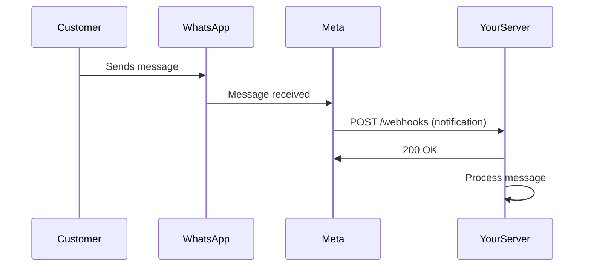

# WhatsApp Business Platform - Account Setup & Configuration Guide

**Complete Guide to App Setup, Webhooks, Access Tokens, and App Review**

**Last Updated**: January 8, 2026  
**Source**: Meta WhatsApp Business Platform Official Training

---

## Table of Contents

1. [Getting Started with Meta Developer Account](#getting-started)
2. [Creating and Configuring Your App](#creating-app)
3. [Associating App with Business Portfolio](#business-portfolio)
4. [Sending Your First Test Message](#first-message)
5. [Configuring Webhooks](#configuring-webhooks)
6. [Generating Access Tokens](#access-tokens)
7. [Passing App Review](#app-review)
8. [Best Practices and Troubleshooting](#best-practices)

---

## Getting Started with Meta Developer Account {#getting-started}

Before you can integrate with any Meta products including WhatsApp Business Platform, you need to create a developer account and configure an app.

### Step 1: Create Developer Account

**Process**:

1. **Go to Meta for Developers**  
   Visit [https://developers.facebook.com](https://developers.facebook.com)

2. **Click "Get Started"**  
   Located in the top-right corner of the page

3. **Agree to Terms**  
   - Click **"Next"** to accept Platform Terms
   - Accept Developer Policies

4. **Verify Your Account**  
   Meta will ask you to verify your account via:
   - Email confirmation
   - Phone number (SMS code)
   - Two-factor authentication (if enabled on your Facebook account)

5. **Select Your Occupation**  
   Choose the option that best describes you:
   - **Developer**: Building apps yourself
   - **Business Owner**: Managing business integration
   - **Other**: Consulting, agency, etc.

**What You Get**:
- ✅ Access to Meta App Dashboard
- ✅ Ability to create apps
- ✅ Access to developer documentation
- ✅ Developer community access

**Important Notes**:
- You need a personal Facebook account to create a developer account
- Your developer account is linked to your Facebook profile
- Business activities will be separate (Business Manager)

---

## Creating and Configuring Your App {#creating-app}

Once your developer account is ready, you can create your first app using the App Dashboard.

### Understanding the App Creation Flow

The app creation flow collects minimum information needed to generate a unique App ID. After completion, you can add more details or start building and testing.

### App Dashboard Overview


When you first access the App Dashboard, you'll see an empty state prompting you to create your first app.

### Step-by-Step App Creation

#### Step 1: Start App Creation

1. Go to [App Dashboard](https://developers.facebook.com/apps)
2. Click **"Create App"** button (green button in center)

#### Step 2: Select App Type


**Available App Types**:

| App Type | Purpose | When to Use |
|----------|---------|-------------|
| **Business** ✅ | Manage business assets (WhatsApp, Pages, Ads) | **For WhatsApp Business API** |
| Consumer | Facebook Login, Profile access | Social login features |
| Gaming | Facebook Gaming integration | Game applications |
| None | Mix of consumer and business | Specific use cases |

**For WhatsApp Business Platform**:
1. Select **"Business"** (with briefcase icon)
2. Read description: "Create or manage business assets like Pages, Events, Groups, Ads, Messenger, WhatsApp, and Instagram Graph API using the available business permissions, features and products."
3. Click **"Next"**

**Why Business Type?**
- Required for WhatsApp Business Management API
- Provides access to business-specific permissions
- Enables management of business assets

#### Step 3: Add App Details


**Required Information**:

**1. App Name**
- Name that will appear in "My Apps" page
- Associated with your App ID
- Can be changed later in Settings
- Examples:
  - `Company WhatsApp Integration`
  - `Customer Service Platform`
  - `E-commerce Messaging`

**2. App Contact Email**
- Email Meta will use to contact you about the app
- Important for:
  - Policy violations notifications
  - App restrictions alerts
  - Recovery if app is compromised
- **Best Practice**: Use a monitored team email, not personal
- Pre-filled with your primary Facebook email (can change)

**3. Business Account (Optional)**
- Connecting a Business Account is optional at this stage
- Required for certain products and permissions
- Can be connected later
- Dropdown shows: "No Business Manager account selected"

**4. Accept Terms**
- Checkbox: "By proceeding, you agree to the Meta Platform Terms and Developer Policies"
- Links provided to review terms

**5. Click "Create app"**

#### Step 4: App Created Successfully

After creation, you'll receive:
- **App ID**: Unique identifier (e.g., `1234567890123456`)
- **App Secret**: Secret key for authentication (keep secure!)
- **App Dashboard Access**: Manage settings, add products

**App Dashboard Sections**:
```
├── Dashboard (Overview)
├── Products (Add WhatsApp, Messenger, etc.)
├── App Review
├── Roles (Manage team access)
├── Webhooks
└── Settings
    ├── Basic (App ID, Secret, Details)
    ├── Advanced
    └── ...
```

### Step 5: Add WhatsApp Product

**After app creation**:

1. In App Dashboard, scroll to **"Add products to your app"**
2. Find **"WhatsApp"** card
3. Click **"Set Up"**
4. Follow WhatsApp setup wizard:
   - Review WhatsApp Business API overview
   - Agree to WhatsApp Business terms
   - Click **"Get Started"**

**WhatsApp Product Features Unlocked**:
- ✅ API Setup panel
- ✅ Phone number management
- ✅ Message templates
- ✅ Webhook configuration
- ✅ Test message sending

### Important: Note Your App Credentials

After app creation, immediately save these:

**App ID**:
```
Settings > Basic > App ID
Example: 123456789012345
```

**App Secret**:
```
Settings > Basic > App Secret
Click "Show" to reveal
Example: abc123def456ghi789...
```

**⚠️ CRITICAL**:
- Never commit App Secret to version control
- Store in environment variables
- Don't share publicly
- Rotate if compromised

---

## Associating App with Business Portfolio {#business-portfolio}

### Why Associate with Business Portfolio?

Connecting your app to a Business Manager portfolio enables you to:
- Manage multiple apps for your business
- Control team access and permissions
- Separate business and personal activities
- Comply with business verification requirements

### Prerequisites

- **App created** with App ID
- **Business Manager account** created
- **Admin role** in the Business Manager

### Association Process

#### Method 1: During App Creation

If you selected a Business Account in Step 3 of app creation, the association is automatic.

#### Method 2: After App Creation

**Steps**:

1. **Go to Business Settings**  
   [https://business.facebook.com/settings](https://business.facebook.com/settings)

2. **Navigate to Apps**  
   - In left sidebar, find **"Accounts"**
   - Click **"Apps"**

3. **Add App**  
   - Click **"Add"** dropdown button
   - Select **"Connect an app ID"**

4. **Enter App ID**  
   - Paste your App ID from App Dashboard
   - Example: `123456789012345`

5. **Click "Add app"**

6. **Verify Connection**  
   - App should appear in your apps list
   - Status will show as "Connected"

**What This Enables**:
- ✅ Shared team access to the app
- ✅ Business verification association
- ✅ System user token generation
- ✅ WhatsApp Business Account linking
- ✅ Advanced permissions in App Review

### Verification

**To confirm successful association**:

1. In App Dashboard > Settings > Basic
2. Look for **"Business Account"** section
3. Should display your Business Manager name
4. Status: **"Connected"**

---

## Sending Your First Test Message {#first-message}

Now you're ready to make your first API call and send a test message!

### Prerequisites Checklist

Before sending test messages:
- ✅ App created with WhatsApp product added
- ✅ At least one phone number in your WABA
- ✅ Phone number verified
- ✅ Recipient number(s) added to test list

### Step 1: Access Developer Console

**Navigation**:
1. Go to [App Dashboard](https://developers.facebook.com/apps)
2. Select your app
3. In left sidebar, find **"Products"**
4. Under **"WhatsApp"**, click **"Developer console"**

OR:

1. In left sidebar, click **"WhatsApp"**
2. Click **"API Setup"**

### Step 2: Add Recipient Numbers

**Why?**: During development, you can only send messages to pre-approved recipient numbers (up to 5).

**Process**:

1. In **"API Setup"** panel, find **"Send and receive messages"** section
2. Click the **"To"** field dropdown
3. Select **"Manage phone number list"**

4. **Add Recipient Dialog Opens**:
   - Enter phone number with country code
   - Example: `+919876543210`
   - Click **"Add"**

5. **Verify Recipient**:
   - Recipient receives OTP code on WhatsApp
   - They send the code back to you
   - Enter code to verify
   - Recipient is now authorized

6. **Repeat for up to 5 numbers**

**Best Practice**:
- Add your own WhatsApp number first
- Add team member numbers
- Add test device numbers
- Keep list updated

### Step 3: Send Your First Message

**In API Setup Panel**:

1. **From Field**:
   - Should auto-select your test business phone number
   - If multiple, choose the one you want to use

2. **To Field**:
   - Select verified recipient number
   - Can select multiple to send bulk test

3. **Message Template**:
   - By default, uses `hello_world` template
   - This template is pre-approved by Meta

4. **Send Message**:
   - Click **"Send message"** button
   - API call executes immediately

**Sample API Call** (shown in panel):
```json
{
  "messaging_product": "whatsapp",
  "to": "+919876543210",
  "type": "template",
  "template": {
    "name": "hello_world",
    "language": {
      "code": "en_US"
    }
  }
}
```

**What Happens**:
1. API call sent to Cloud API endpoint
2. WhatsApp processes the template
3. Message delivered to recipient's WhatsApp
4. Delivery status appears in panel

**Expected Response**:
```json
{
  "messaging_product": "whatsapp",
  "contacts": [
    {
      "input": "+919876543210",
      "wa_id": "919876543210"
    }
  ],
  "messages": [
    {
      "id": "wamid.HBgNOTE5ODc2NTQzMjEwFQIAERgSQTU0QTNC..."
    }
  ]
}
```

**Recipient Sees**:
```
Hello World!
This is a test message from WhatsApp Business API.
```

### Step 4: Verify Message Received

**On Your Recipient Device**:
1. Open WhatsApp
2. Check for new message from your business number
3. Message should show:
   - Business name (or phone number)
   - "Hello World" template text
   - Timestamp

**Success Indicators**:
- ✅ Message delivered (double check marks)
- ✅ No error in API response
- ✅ Business number shows in recipient's chat list

### Next Steps

After successfully sending your first message:
1. ✅ Messages work end-to-end
2. ✅ Ready to configure webhooks (receive messages)
3. ✅ Ready to create custom templates
4. ✅ Ready to build your integration

---

## Configuring Webhooks {#configuring-webhooks}

Webhooks are HTTP callbacks that enable you to receive real-time notifications from WhatsApp Business Platform.

### What Are Webhooks?

**Definition**: HTTP callbacks triggered by specific events.

**Purpose**: Receive real-time notifications about:
- 📨 Incoming messages from customers
- ✅ Message delivery status (sent, delivered, read, failed)
- 🔔 Account updates
- 📱 Phone number changes
- 📝 Template approval status
- 👤 Customer profile updates

**How It Works**:


### Webhook Subscription Requirements

**Your app must**:
1. Be subscribed to webhooks on a Business Portfolio
2. Have permission to edit that Business Portfolio
3. Have configured webhook endpoint

**You only receive notifications if all three conditions are met.**

### Creating a Webhook Subscription

#### Option 1: Direct API Call (Recommended for Automation)

**Subscribe to Webhooks**:

```bash
curl -X POST \
  'https://graph.facebook.com/v18.0/{WHATSAPP_BUSINESS_ACCOUNT_ID}/subscribed_apps' \
  -H 'Authorization: Bearer {ACCESS_TOKEN}'
```

**Success Response**:
```json
{
  "success": "true"
}
```

**Get Subscribed Apps**:

```bash
curl -X GET \
  'https://graph.facebook.com/v18.0/{WHATSAPP_BUSINESS_ACCOUNT_ID}/subscribed_apps' \
  -H 'Authorization: Bearer {ACCESS_TOKEN}'
```

**Response**:
```json
{
  "data": [
    {
      "whatsapp_business_api_data": {
        "link": "https://developers.facebook.com/apps/123456/",
        "name": "My WhatsApp App",
        "id": "123456789012345"
      }
    }
  ]
}
```

**Delete Subscription**:

```bash
curl -X DELETE \
  'https://graph.facebook.com/v18.0/{WHATSAPP_BUSINESS_ACCOUNT_ID}/subscribed_apps' \
  -H 'Authorization: Bearer {ACCESS_TOKEN}'
```

#### Option 2: Graph API Explorer

For manual testing without writing code:

1. Go to [Graph API Explorer](https://developers.facebook.com/tools/explorer)
2. Select your app from dropdown
3. Replace `me?fields=id,name` with:
   ```
   {WHATSAPP_BUSINESS_ACCOUNT_ID}/subscribed_apps
   ```
4. Change method to **POST**
5. Click **"Submit"**
6. Your app is now subscribed

**Note**: Your app must have permission to edit the Business Portfolio.

### Creating Your Webhook Endpoint

#### Server Requirements

Your webhook endpoint MUST:
- ✅ Be publicly accessible on the internet
- ✅ Use HTTPS with valid TLS/SSL certificate
- ✅ Respond to GET requests (verification)
- ✅ Respond to POST requests (notifications)
- ✅ Return 200 OK within 20 seconds
- ❌ Self-signed certificates NOT supported

#### Webhook Endpoint Structure

**URL Format**: `https://your-domain.com/webhooks/whatsapp`

**Must Handle Two Request Types**:
1. **GET**: Verification requests (setup)
2. **POST**: Event notifications (runtime)

### Implementing Endpoint Verification (GET)

When you configure webhooks, Meta sends a GET request to verify your endpoint.

**Verification Request Structure**:

```
GET https://your-domain.com/webhooks/whatsapp?
  hub.mode=subscribe&
  hub.challenge=1158201444&
  hub.verify_token=your_secret_token
```

**Query Parameters**:

| Parameter | Example | Description |
|-----------|---------|-------------|
| `hub.mode` | `subscribe` | Always set to "subscribe" |
| `hub.challenge` | `1158201444` | Random integer to echo back |
| `hub.verify_token` | `your_secret_token` | Your custom verification token |

**Your Endpoint Must**:
1. Check if `hub.verify_token` matches your secret
2. If matches, respond with `hub.challenge` value
3. If doesn't match, return 403 Forbidden

**Implementation Example (Node.js/Express)**:

```javascript
const express = require('express');
const app = express();

// Webhook verification endpoint
app.get('/webhooks/whatsapp', (req, res) => {
  const VERIFY_TOKEN = process.env.WEBHOOK_VERIFY_TOKEN;
  
  // Parse params
  const mode = req.query['hub.mode'];
  const token = req.query['hub.verify_token'];
  const challenge = req.query['hub.challenge'];
  
  // Check mode and token
  if (mode === 'subscribe' && token === VERIFY_TOKEN) {
    console.log('✅ Webhook verified');
    res.status(200).send(challenge);
  } else {
    console.log('❌ Verification failed');
    res.sendStatus(403);
  }
});
```

**Python/Flask Example**:

```python
from flask import Flask, request
import os

app = Flask(__name__)

@app.route('/webhooks/whatsapp', methods=['GET'])
def verify_webhook():
    VERIFY_TOKEN = os.getenv('WEBHOOK_VERIFY_TOKEN')
    
    mode = request.args.get('hub.mode')
    token = request.args.get('hub.verify_token')
    challenge = request.args.get('hub.challenge')
    
    if mode == 'subscribe' and token == VERIFY_TOKEN:
        print('✅ Webhook verified')
        return challenge, 200
    else:
        print('❌ Verification failed')
        return 'Forbidden', 403
```

### Configuring Webhooks in App Dashboard


**Step 1: Access Webhook Settings**

1. Go to App Dashboard
2. Select **"WhatsApp" > "Configuration"** in left sidebar
3. Scroll to **"Webhooks"** section
4. Click **"Configure webhooks"** or **"Edit"**

**Step 2: Add Callback URL and Verify Token**

Dialog appears with two fields:

**Callback URL**:
- Enter your public HTTPS endpoint
- Example: `https://your-clever-domain-name.com/webhooks`
- Must be accessible from internet
- Must have valid SSL certificate

**Verify Token**:
- Enter your custom secret string
- Example: `TheTokenOfVerification`
- Must match what your server expects
- Keep this secret and secure

**Step 3: Verify and Save**

1. Click **"Verify and Save"** button
2. Meta makes GET request to your endpoint
3. Your endpoint validates and returns challenge
4. If successful: ✅ "Webhook verified successfully"
5. If failed: ❌ Error message with details

**Common Verification Errors**:
- ❌ URL not reachable (check firewall)
- ❌ SSL certificate invalid
- ❌ Endpoint not responding to GET
- ❌ Verify token mismatch
- ❌ Didn't return challenge value

**Step 4: Subscribe to Webhook Fields**

After verification, select which events to receive:

**Available Fields for WhatsApp Business Account**:

| Field | Description | Recommended |
|-------|-------------|-------------|
| `messages` | Incoming/outgoing messages, delivery, read receipts | ✅ Essential |
| `message_status` | Delivery status updates | ✅ Essential |
| `message_template_status_update` | Template approval/rejection | ✅ Important |
| `message_template_quality_update` | Template quality rating changes | ✅ Important |
| `phone_number_name_update` | Display name approval | ✅ Important |
| `phone_number_quality_update` | Phone number quality changes | ✅ Important |
| `account_alerts` | Account status decisions | ✅ Important |
| `account_review_update` | Account review notifications | ⚠️ Optional |
| `account_update` | Account changes (ban, policy violation) | ✅ Important |
| `business_capability_update` | Capability changes | ⚠️ Optional |
| `security` | Two-step verification changes | ⚠️ Optional |

**To Subscribe**:
1. Click checkbox next to each field
2. Selected fields will send notifications
3. Click **"Save"**

### Handling Webhook Event Notifications (POST)

Once configured, Meta sends POST requests to your endpoint when events occur.

**Event Notification Structure**:

```json
{
  "object": "whatsapp_business_account",
  "entry": [
    {
      "id": "WHATSAPP_BUSINESS_ACCOUNT_ID",
      "time": 1602782939,
      "changes": [
        {
          "field": "messages",
          "value": {
            "messaging_product": "whatsapp",
            "metadata": {
              "display_phone_number": "16505551111",
              "phone_number_id": "123456789"
            },
            "contacts": [
              {
                "profile": {
                  "name": "Customer Name"
                },
                "wa_id": "16505551234"
              }
            ],
            "messages": [
              {
                "from": "16505551234",
                "id": "wamid.ID",
                "timestamp": "1602782939",
                "type": "text",
                "text": {
                  "body": "Hello, I need help with my order"
                }
              }
            ]
          }
        }
      ]
    }
  ]
}
```

**Implementation Example**:

```javascript
app.post('/webhooks/whatsapp', express.json(), (req, res) => {
  // IMPORTANT: Respond 200 OK immediately
  res.sendStatus(200);
  
  // Process async to avoid timeout
  const body = req.body;
  
  // Validate webhook payload
  if (body.object !== 'whatsapp_business_account') {
    return;
  }
  
  // Process each entry
  body.entry.forEach(entry => {
    // Each entry has changes
    const changes = entry.changes;
    
    changes.forEach(change => {
      // Get field type
      const field = change.field;
      const value = change.value;
      
      // Handle different event types
      switch(field) {
        case 'messages':
          handleMessages(value);
          break;
          
        case 'message_template_status_update':
          handleTemplateUpdate(value);
          break;
          
        case 'phone_number_quality_update':
          handleQualityUpdate(value);
          break;
          
        default:
          console.log(`Unhandled field: ${field}`);
      }
    });
  });
});

function handleMessages(value) {
  // Check for new messages
  if (value.messages) {
    value.messages.forEach(message => {
      console.log('📨 New message:');
      console.log('From:', message.from);
      console.log('Type:', message.type);
      console.log('Text:', message.text?.body);
      console.log('Timestamp:', message.timestamp);
      
      // Process message (send to bot, agent, etc.)
      processIncomingMessage(message);
    });
  }
  
  // Check for status updates
  if (value.statuses) {
    value.statuses.forEach(status => {
      console.log('✅ Status update:');
      console.log('Message ID:', status.id);
      console.log('Status:', status.status); // sent, delivered, read, failed
      console.log('Timestamp:', status.timestamp);
      
      // Update message status in database
      updateMessageStatus(status);
    });
  }
}
```

### Validating Webhook Payloads

**Why Validate?**: Ensure requests are genuinely from Meta, not attackers.

**How Meta Signs Payloads**:
- Uses SHA256 signature
- Includes signature in `X-Hub-Signature-256` header
- Format: `sha256=<signature>`

**Validation Steps**:

```javascript
const crypto = require('crypto');

function validateWebhookSignature(req, res, next) {
  const signature = req.headers['x-hub-signature-256'];
  
  if (!signature) {
    return res.sendStatus(403);
  }
  
  // Generate signature
  const appSecret = process.env.APP_SECRET;
  const payload = JSON.stringify(req.body);
  
  const expectedSignature = 'sha256=' + 
    crypto
      .createHmac('sha256', appSecret)
      .update(payload)
      .digest('hex');
  
  // Compare signatures
  if (signature === expectedSignature) {
    next(); // Valid
  } else {
    res.sendStatus(403); // Invalid
  }
}

// Use as middleware
app.post('/webhooks/whatsapp', 
  express.json({verify: validateWebhookSignature}),
  (req, res) => {
    // Process webhook
  }
);
```

### Responding to Event Notifications

**Critical Rules**:
1. ✅ **Always respond with 200 OK**
2. ✅ **Respond within 20 seconds**
3. ✅ **Process webhook asynchronously**
4. ✅ **Handle duplicate notifications**

**Why 200 OK Immediately?**
- If you don't respond quickly, Meta retries
- Retries happen with decreasing frequency over 36 hours
- Unacknowledged responses dropped after 36 hours

**Deduplication Strategy**:

```javascript
const processedMessages = new Set();

function processIncomingMessage(message) {
  // Check if already processed
  if (processedMessages.has(message.id)) {
    console.log('Duplicate message, skipping');
    return;
  }
  
  // Mark as processed
  processedMessages.add(message.id);
  
  // Process message
  // ...
  
  // Clean up old IDs after 24 hours
  setTimeout(() => {
    processedMessages.delete(message.id);
  }, 24 * 60 * 60 * 1000);
}
```

### Sample Webhook Payloads

**Example 1: Text Message Received**:
```json
{
  "object": "whatsapp_business_account",
  "entry": [{
    "id": "0",
    "time": 1602782939,
    "changes": [{
      "field": "messages",
      "value": {
        "messaging_product": "whatsapp",
        "metadata": {
          "display_phone_number": "16505551111",
          "phone_number_id": "123456"
        },
        "contacts": [{
          "profile": {"name": "John Doe"},
          "wa_id": "16505551234"
        }],
        "messages": [{
          "from": "16505551234",
          "id": "wamid.HBgNMTY1MDU1NTEyMzQVAgARGBI5QTNC...",
          "timestamp": "1602782939",
          "type": "text",
          "text": {"body": "Hello!"}
        }]
      }
    }]
  }]
}
```

**Example 2: Message Delivered Status**:
```json
{
  "object": "whatsapp_business_account",
  "entry": [{
    "id": "0",
    "time": 1602782940,
    "changes": [{
      "field": "messages",
      "value": {
        "messaging_product": "whatsapp",
        "metadata": {
          "display_phone_number": "16505551111",
          "phone_number_id": "123456"
        },
        "statuses": [{
          "id": "wamid.HBgNMTY1MDU1NTEyMzQVAgARGBI5QTNC...",
          "status": "delivered",
          "timestamp": "1602782940",
          "recipient_id": "16505551234"
        }]
      }
    }]
  }]
}
```

**Example 3: Template Status Update**:
```json
{
  "object": "whatsapp_business_account",
  "entry": [{
    "id": "0",
    "time": 1602782939,
    "changes": [{
      "field": "message_template_status_update",
      "value": {
        "event": "APPROVED",
        "message_template_id": "123456",
        "message_template_name": "order_confirmation",
        "message_template_language": "en_US",
        "reason": ""
      }
    }]
  }]
}
```

### Testing Your Webhooks

**Method 1: Send Test Event**

1. In App Dashboard > WhatsApp > Configuration > Webhooks
2. Next to subscribed field, click **"Test"**
3. Sample payload sent to your endpoint
4. Check server logs for received payload

**Method 2: Send Real Message**

1. From your personal WhatsApp, message your business number
2. Check server logs for incoming message webhook
3. Verify message details are correct

**Method 3: Use Webhook Testing Tools**

- [Webhook.site](https://webhook.site/) - Inspect webhook payloads
- [ngrok](https://ngrok.com/) - Expose local server for testing
- [Postman](https://www.postman.com/) - Simulate webhook calls

**Example with ngrok**:
```bash
# Start your server locally
node server.js

# In another terminal, start ngrok
ngrok http 3000

# Use ngrok URL as callback URL
# https://abc123.ngrok.io/webhooks/whatsapp
```

---

## Generating Access Tokens {#access-tokens}

Access tokens authenticate your app when calling the Graph API.

### Understanding Token Types

**Two Main Types**:

| Token Type | Use Case | Lifetime | Recommended |
|------------|----------|----------|-------------|
| **User Access Token** | Testing, personal use | Hours to 60 days | ❌ Not for production |
| **System User Access Token** | Production apps | Permanent (never expires) | ✅ Recommended |

**Who Uses Which Token?**

**Direct Developer** (you're building for your own business):
- Use **System User Access Tokens**
- Full control of your data
- Permanent tokens

**Tech Provider** (building platform for clients):
- Use **Business Integration System User Access Tokens**
- Generated via embedded signup
- Scoped to client's WABA

**Solution Partner** (managing client accounts):
- Use **Business Integration System User Access Tokens**
- Generated via embedded signup
- Full management capabilities

### Generating System User Access Tokens

**Use Case**: Direct developers managing their own WhatsApp Business Account.

#### Step 1: Create System User

1. **Go to Business Settings**  
   [https://business.facebook.com/settings](https://business.facebook.com/settings)

2. **Navigate to System Users**  
   - In left sidebar, expand **"Users"**
   - Click **"System Users"**

3. **Add System User**  
   - Click **"Add"** button
   - Enter name (e.g., `whatsapp-api-production`)
   - Select role: **"Admin"** (required for WhatsApp)
   - Click **"Create System User"**

#### Step 2: Assign Assets to System User

**Assign App**:
1. Click on your System User in the list
2. Click **"Add Assets"**
3. Go to **"Apps"** tab
4. Find your WhatsApp app
5. Toggle **"Manage app"** to ON
6. Click **"Save Changes"**

**Assign WABA**:
1. Still in System User view
2. Click **"Add Assets"** again
3. Go to **"WhatsApp Accounts"** tab
4. Find your WABA
5. Toggle **"Manage WhatsApp Business Account"** to ON
6. Click **"Save Changes"**

#### Step 3: Generate Token

1. With System User selected, click **"Generate New Token"**

2. **Select App**: Choose your WhatsApp Business App from dropdown

3. **Set Token Expiration**:
   - **Never** ✅ (permanent token - RECOMMENDED)
   - 60 days ⚠️ (not recommended for production)

4. **Select Permissions**:
   - ✅ `business_management`
   - ✅ `whatsapp_business_management`
   - ✅ `whatsapp_business_messaging`

5. **Click "Generate Token"**

6. **Copy Token Immediately**  
   ⚠️ Token shown only once!
   ```
   EAAxx...long string...xxxx
   ```

7. **Store Securely**:
   ```bash
   # .env file
   WHATSAPP_ACCESS_TOKEN=EAAxx...xxxx
   
   # Never commit to Git!
   # Use environment variables
   ```

### Generating Business Integration System User Tokens

**Use Case**: Tech providers and solution partners accessing client data after embedded signup.

#### Overview

When a business completes embedded signup flow, you receive a code that can be exchanged for an access token.

#### Step 1: Implement Embedded Signup

(Covered in separate lesson - see embedded signup documentation)

**Result**: When client finishes signup, you receive:
```json
{
  "authResponse": {
    "userID": null,
    "expiresIn": null,
    "code": "CODE_TO_BE_EXCHANGED"
  },
  "status": "connected"
}
```

#### Step 2: Exchange Code for Token

**Server-to-Server Call**:

```bash
curl -X GET \
  'https://graph.facebook.com/v18.0/oauth/access_token?client_id={APP_ID}&client_secret={APP_SECRET}&code={CODE}'
```

**Parameters**:
- `client_id`: Your App ID
- `client_secret`: Your App Secret (⚠️ NEVER expose in client code!)
- `code`: Code received from embedded signup

**Response**:
```json
{
  "access_token": "EAAxx...business-integration-token...xxxx",
  "token_type": "bearer"
}
```

**⚠️ CRITICAL SECURITY**:
- Never include App Secret in client-side code
- Never commit App Secret to version control
- Only call this endpoint from your server
- Store token securely

**Implementation Example**:
```javascript
const axios = require('axios');

async function exchangeCodeForToken(code) {
  const APP_ID = process.env.APP_ID;
  const APP_SECRET = process.env.APP_SECRET;
  
  const response = await axios.get(
    'https://graph.facebook.com/v18.0/oauth/access_token',
    {
      params: {
        client_id: APP_ID,
        client_secret: APP_SECRET,
        code: code
      }
    }
  );
  
  return response.data.access_token;
}
```

#### Step 3: Complete Integration

After obtaining token, complete these steps:

**1. Get WhatsApp Business Account ID**

**Option A: Session Logging**  
If you set up session logging in embedded signup script, payload automatically sent to your callback:
```json
{
  "phone_number_id": "123456789",
  "waba_id": "987654321"
}
```

**Option B: Debug Token API**
```bash
curl -X GET \
  'https://graph.facebook.com/v18.0/debug_token?input_token={BUSINESS_INTEGRATION_TOKEN}' \
  -H 'Authorization: Bearer {YOUR_APP_ACCESS_TOKEN}'
```

**2. Get Phone Number ID**

**Option A: Session Logging** (if configured)

**Option B: Phone Numbers Endpoint**
```bash
curl -X GET \
  'https://graph.facebook.com/v18.0/{WABA_ID}/phone_numbers' \
  -H 'Authorization: Bearer {BUSINESS_INTEGRATION_TOKEN}'
```

Response:
```json
{
  "data": [
    {
      "id": "123456789",
      "display_phone_number": "+1 650-555-1111",
      "verified_name": "Business Name",
      "quality_rating": "GREEN"
    }
  ]
}
```

**3. Register Phone Number**
```bash
curl -X POST \
  'https://graph.facebook.com/v18.0/{PHONE_NUMBER_ID}/register' \
  -H 'Authorization: Bearer {BUSINESS_INTEGRATION_TOKEN}' \
  -d 'messaging_product=whatsapp&pin=<2FA_PIN>'
```

**4. Subscribe to Webhooks**
```bash
curl -X POST \
  'https://graph.facebook.com/v18.0/{WABA_ID}/subscribed_apps' \
  -H 'Authorization: Bearer {BUSINESS_INTEGRATION_TOKEN}'
```

**5. Send Test Message**

Act as customer and send message to business number, then reply:
```bash
curl -X POST \
  'https://graph.facebook.com/v18.0/{PHONE_NUMBER_ID}/messages' \
  -H 'Authorization: Bearer {BUSINESS_INTEGRATION_TOKEN}' \
  -H 'Content-Type: application/json' \
  -d '{
    "messaging_product": "whatsapp",
    "to": "{CUSTOMER_PHONE}",
    "type": "text",
    "text": {"body": "Thank you for your message!"}
  }'
```

**6. Attach System User to WABA**

Add your system user to shared WABA for programmatic management:
- Follow system user management guide
- Assign WABA to system user
- Generate system user token for this WABA

### Required Permissions

Regardless of token type, you need these permissions:

**Essential Permissions**:
- ✅ `whatsapp_business_management` - Required for all WABA operations
- ✅ `whatsapp_business_messaging` - Required for sending messages via Cloud API
- ⚠️ `business_management` - Optional, for Business Manager setup

**Permission Scopes**:

| Permission | Enables |
|------------|---------|
| `whatsapp_business_management` | Create/manage WABAs, templates, phone numbers, get insights |
| `whatsapp_business_messaging` | Send/receive messages, mark as read, upload media |
| `business_management` | Manage Business Manager assets, system users |

### API Rate Limits

**Business Management API Limits**:
- **5,000 calls per hour**
- Per app
- Per active WhatsApp Business Account

**Active Account Definition**: WABA with at least one registered phone number.

**Calls That Count Towards Limit**:

| Method | Endpoint | Counts? |
|--------|----------|---------|
| GET | `/{waba-id}` | ✅ Yes |
| GET, POST, DELETE | `/{waba-id}/assigned_users` | ✅ Yes |
| GET | `/{waba-id}/phone_numbers` | ✅ Yes |
| POST, DELETE | `/{waba-id}/message_templates` | ✅ Yes |
| GET, POST, DELETE | `/{waba-id}/subscribed_apps` | ✅ Yes |
| GET | `/{phone-number-id}` | ✅ Yes |

**Rate Limit Headers** (in API responses):
```
X-Business-Use-Case-Usage: {"call_count":100,"total_cputime":25,"total_time":50}
```

**Avoiding Rate Limits**:
1. ✅ Use webhooks instead of polling
2. ✅ Cache frequently accessed data
3. ✅ Batch operations when possible
4. ✅ Implement exponential backoff on errors

**Example Rate Limit Handler**:
```javascript
async function callAPI(endpoint, options) {
  try {
    const response = await axios(endpoint, options);
    return response.data;
  } catch (error) {
    if (error.response?.status === 429) {
      // Rate limited
      const retryAfter = error.response.headers['retry-after'] || 60;
      console.log(`Rate limited. Retry after ${retryAfter}s`);
      
      await sleep(retryAfter * 1000);
      return callAPI(endpoint, options); // Retry
    }
    throw error;
  }
}
```

---

## Passing App Review {#app-review}

App Review verifies that your app uses Meta technologies and APIs in an approved manner.

### Purpose of App Review

**Why Required?**
- Verify compliance with Meta policies
- Ensure data is used appropriately
- Protect user privacy
- Maintain platform security

**What's Reviewed?**
- Permissions your app requests
- How you use those permissions
- Your app's functionality
- Data handling practices

### Access Levels

**Standard Access** (Automatic):
- ✅ Automatically granted to business apps
- ✅ Can develop and test
- ⚠️ Limited to data owned by app users
- ⚠️ Limited to people with app roles

**Advanced Access** (Requires Review):
- ✅ Access client/customer data
- ✅ Production use
- ✅ Public release
- ⚠️ Must pass App Review

### Common Rejection Reasons

Before submitting, avoid these mistakes:

**❌ Incomplete Demo**:
- Doesn't show all requested permissions
- Missing critical functionality
- Not in English (or no captions)

**❌ Poor Description**:
- Too vague or generic
- Doesn't explain permission usage
- Copied/pasted same text for all permissions

**❌ Missing Business Verification**:
- Business not verified
- Verification pending

**❌ Policy Violations**:
- Collects unnecessary data
- Violates WhatsApp policies
- Unclear data usage

### App Review Process - Step by Step

#### Step 1: Select Permissions and Features

1. **Go to App Review**  
   App Dashboard > App Review > Permissions and features

2. **Understanding Current Access**  
   Business apps have **Standard Access** by default for all permissions

3. **Request Advanced Access**  
   For WhatsApp, you need:
   - ✅ `whatsapp_business_management` - Advanced Access
   - ✅ `whatsapp_business_messaging` - Advanced Access

4. **Add to Submission**  
   - Search for each permission
   - Click **"Request advanced access"** button
   - Both added to your submission

5. **Continue**  
   Click **"Continue request"** button

**Important Notes**:
- ⚠️ Only request permissions you actually need
- ⚠️ Start review process ASAP (even before full implementation)
- ⚠️ Tech providers/solution partners can start before embedded signup is complete

#### Step 2: Complete Business Verification

If not already verified:
- Provide business documentation
- Verify business address
- Wait for approval (1-5 days)
- Return to App Review after verification

If already verified ✅:
- Proceed to next step

#### Step 3: Answer Data Handling Questions

**May be prompted to answer questions about**:
- What data you collect
- How you use the data
- How long you store data
- Who has access to data
- Data retention policies

**Response Evaluation**:
- Automated evaluation
- Takes ~30 seconds
- Be honest and accurate

#### Step 4: Complete App Settings

**Required Settings** (Settings > Basic):
- ✅ App name
- ✅ App logo/icon
- ✅ Privacy Policy URL
- ✅ Terms of Service URL
- ✅ App domain(s)
- ✅ Contact email

**Example**:
```
App name: Customer Support Platform
Logo: [Upload 1024x1024 image]
Privacy Policy: https://yourcompany.com/privacy
Terms of Service: https://yourcompany.com/terms
App Domain: yourcompany.com
Contact Email: support@yourcompany.com
```

#### Step 5: Complete App Verification Details

**Platform Settings**:
- Confirm all information is correct
- Make adjustments if needed

**Access Description**:
Write clear instructions on how your app can be accessed for testing.

**✅ Good Example**:
```
Our WhatsApp integration can be tested by:
1. Sending a WhatsApp message to +1-650-555-1111
2. The bot will respond with a menu of options
3. Select option 1 to see product catalog
4. Select option 2 to speak with an agent
5. Test messages will demonstrate whatsapp_business_messaging permission

Note: Use test account credentials (not personal accounts)
```

**❌ Bad Example**:
```
Send a message to test the app.
```

**Important**:
- ❌ Don't include your personal Facebook credentials
- ✅ App tested using test accounts
- ✅ Provide step-by-step instructions
- ✅ Be specific and detailed

#### Step 6: Complete Usage Descriptions

**For Each Permission/Feature**:

1. Click permission in list
2. Write detailed description
3. Upload screen recording

**Description Guidelines**:

**Answer These Questions**:
- How does this permission help app users?
- Why does your app need this permission?
- How does your app use the data?
- Why would the app be less useful without it?

**✅ Good Description** (`whatsapp_business_messaging`):
```
Our customer support platform uses whatsapp_business_messaging 
to send automated responses to customer inquiries and enable 
human agents to respond to customer messages in real-time.

When a customer sends a message to our business WhatsApp number:
1. The bot analyzes the message content
2. If it's a common question, sends automated template response
3. If complex, routes to available human agent
4. Agent responds via our dashboard (uses API to send message)

This permission is essential because:
- 80% of customer inquiries can be automated
- Agents need to respond quickly to complex issues
- Customers prefer WhatsApp over email/phone
- Real-time messaging improves customer satisfaction

Without this permission, we cannot send any messages to customers,
making the entire platform non-functional.
```

**❌ Bad Description**:
```
We need this to send messages.
```

**Don't Copy/Paste**:
- Each permission needs unique description
- Explain specific use for that permission
- Don't use generic text

#### Step 7: Create Screen Recording

**Screen Recording Requirements**:

**Technical Specs**:
- ✅ MP4, MOV, or WebM format
- ✅ Max 500 MB file size
- ✅ Show full screen or app window
- ✅ Use mouse for interactions (not keyboard when possible)

**Content Requirements**:
- ✅ Use English UI language
- ✅ Add captions if not in English
- ✅ Explain non-obvious UI elements
- ✅ Show user granting permissions
- ✅ Demonstrate each permission usage recorded
- ✅ Show full user flow

**Screen Recording Best Practices**:

**1. Language**:
- Set app UI to English before recording
- If not possible, add captions explaining actions
- Use tooltips to explain buttons

**2. Clarity**:
- Show complete workflow
- Don't skip important steps
- Make window full screen or record window only
- Use mouse to highlight what you're doing

**3. Completeness**:
- Show permission grant dialog
- Demonstrate actual permission usage
- Show end result

**Example Recording Script** (whatsapp_business_messaging):
```
[0:00] Show login screen
[0:05] Log in to dashboard (don't show credentials)
[0:10] Navigate to Messages section
[0:15] Show incoming customer message webhook
[0:20] Click "Send Response" button
[0:25] Type response message
[0:30] Click "Send" (API call happens)
[0:35] Show message delivered in WhatsApp
[0:40] Show delivery status webhook received
[0:45] Done
```

**Upload Recording**:
1. Click **"Upload file"**
2. Select your screen recording
3. Wait for upload to complete
4. Verify video plays correctly

**Repeat for Each Permission**:
- Each permission needs own recording
- Can be same video if shows multiple permissions
- Or create separate videos for each

#### Step 8: Submit for Review

1. **Review Submission**:
   - Double-check all descriptions
   - Verify recordings uploaded
   - Confirm settings complete

2. **Submit**:
   - Click **"Submit for review"**
   - Read and accept onboarding terms
   - Click **"Accept"** in popup
   - Submission queued

3. **Wait for Decision**:
   - Review typically takes **3-7 days**
   - May take longer during high volume
   - Check email for updates
   - Monitor App Dashboard for status

4. **Decision Notifications**:
   - ✅ **Approved**: Permissions granted, start using
   - ❌ **Rejected**: Review feedback, fix issues, resubmit
   - ⏸️ **More Info Needed**: Respond to questions

### After Approval

**Once Approved**:
1. ✅ Advanced access granted immediately
2. ✅ Can manage customer data
3. ✅ Can onboard real clients (embedded signup)
4. ✅ Can go to production

**Next Steps**:
- Test with production credentials
- Onboard first customers
- Monitor quality ratings
- Scale operations

### If Rejected

**Common Rejection Reasons**:
1. Incomplete screen recording
2. Not in English (no captions)
3. Missing permission demonstration
4. Vague usage description
5. Policy violations

**How to Fix and Resubmit**:
1. Read rejection feedback carefully
2. Address specific issues mentioned
3. Update descriptions/recordings
4. Resubmit within App Review section
5. No penalty for resubmitting

---

## Best Practices and Troubleshooting {#best-practices}

### Access Token Best Practices

**Security**:
```javascript
// ✅ DO THIS
const TOKEN = process.env.WHATSAPP_ACCESS_TOKEN;

// ❌ NEVER DO THIS
const TOKEN = "EAAxxxx..."; // Hardcoded
```

**Storage**:
- Use environment variables
- Use secret managers (AWS Secrets Manager, Azure Key Vault)
- Encrypt at rest
- Rotate periodically (every 90 days)

**Logging**:
```javascript
// ❌ Don't log tokens
console.log('Token:', accessToken);

// ✅ Log masked version
console.log('Token:', accessToken.substring(0, 10) + '...');
```

### Webhook Best Practices

**Performance**:
```javascript
// ✅ Respond immediately
app.post('/webhooks', (req, res) => {
  res.sendStatus(200);
  
  // Process async
  processWebhook(req.body);
});

// ❌ Don't wait for processing
app.post('/webhooks', async (req, res) => {
  await processWebhook(req.body); // Slow!
  res.sendStatus(200); // Too late
});
```

**Reliability**:
- Implement retry logic
- Use message queues (Bull, RabbitMQ)
- Handle duplicates (check message IDs)
- Log all webhooks

**Monitoring**:
- Track webhook success/failure rates
- Alert on webhook downtime
- Monitor processing times
- Check for missed webhooks

### App Review Best Practices

**Preparation**:
- Start review process early
- Complete business verification first
- Prepare screen recordings in advance
- Write clear, detailed descriptions

**Screen Recording Tips**:
- Use high-quality recording software (OBS, Loom, QuickTime)
- Record in 1080p or 720p
- Keep recordings under 5 minutes
- Show real workflows, not fake demos

**Description Writing**:
- Be specific, not generic
- Explain business value
- Describe exact data usage
- Answer "why" not just "what"

### Common Issues and Solutions

**Issue 1: Webhook Verification Fails**

**Symptoms**:
- "Verification failed" error
- Can't save webhook URL

**Solutions**:
```javascript
// Check verify token matches
const VERIFY_TOKEN = process.env.WEBHOOK_VERIFY_TOKEN;
if (token !== VERIFY_TOKEN) {
  console.log('Token mismatch!');
  console.log('Expected:', VERIFY_TOKEN);
  console.log('Received:', token);
}

// Ensure returning challenge
res.status(200).send(challenge); // Not res.json()
```

**Issue 2: Not Receiving Webhooks**

**Checklist**:
- ✅ Webhook URL publicly accessible?
- ✅ HTTPS with valid certificate?
- ✅ Subscribed to correct fields?
- ✅ App subscribed to WABA?
- ✅ Endpoint returns 200 OK?

**Test**:
```bash
# Test from outside your network
curl https://your-domain.com/webhooks/whatsapp

# Check SSL
curl -v https://your-domain.com/webhooks/whatsapp
```

**Issue 3: Rate Limit Errors**

**Symptoms**:
- 429 status code
- "Rate limit exceeded" error

**Solutions**:
```javascript
// Implement exponential backoff
async function callAPIWithRetry(endpoint, maxRetries = 3) {
  for (let i = 0; i < maxRetries; i++) {
    try {
      return await callAPI(endpoint);
    } catch (error) {
      if (error.response?.status === 429) {
        const delay = Math.pow(2, i) * 1000;
        await sleep(delay);
        continue;
      }
      throw error;
    }
  }
}

// Use webhooks instead of polling
// Cache frequently accessed data
// Batch operations
```

**Issue 4: Token Expired**

**Symptoms**:
- 401 Unauthorized
- "Invalid access token" error

**Solutions**:
- Check token expiration setting
- Use system user tokens (never expire)
- Implement token refresh logic
- Store token securely

---

## Summary

### Complete Setup Checklist

**Account Setup**:
- ✅ Meta Developer account created
- ✅ Business app created with App ID
- ✅ WhatsApp product added to app
- ✅ App associated with Business Portfolio

**Webhook Configuration**:
- ✅ Public HTTPS endpoint created
- ✅ Verification endpoint implemented (GET)
- ✅ Event handler implemented (POST)
- ✅ Webhook configured in App Dashboard
- ✅ Subscribed to necessary fields
- ✅ Test webhook received successfully

**Access Tokens**:
- ✅ System user created
- ✅ Assets assigned to system user
- ✅ Permanent access token generated
- ✅ Token stored securely

**App Review**:
- ✅ Business verification completed
- ✅ Permissions selected
- ✅ Descriptions written for each permission
- ✅ Screen recordings created and uploaded
- ✅ App settings completed
- ✅ Submission approved

### Next Steps

After completing all setup:
1. ✅ Test message sending and receiving
2. ✅ Create custom message templates
3. ✅ Build your integration logic
4. ✅ Implement embedded signup (if provider)
5. ✅ Monitor quality ratings
6. ✅ Scale to production

---

## Additional Resources

**Official Documentation**:
- [App Creation Guide](https://developers.facebook.com/docs/development/create-an-app)
- [Webhook Setup](https://developers.facebook.com/docs/graph-api/webhooks/getting-started)
- [Access Tokens](https://developers.facebook.com/docs/facebook-login/access-tokens)
- [App Review](https://developers.facebook.com/docs/apps/review)
- [Business Verification](https://www.facebook.com/business/help/2058515294227817)

**Tools**:
- [App Dashboard](https://developers.facebook.com/apps)
- [Business Settings](https://business.facebook.com/settings)
- [Graph API Explorer](https://developers.facebook.com/tools/explorer)
- [Webhook Tester](https://webhook.site)

**Support**:
- [Developer Community](https://developers.facebook.com/community)
- [WhatsApp Business Help](https://www.facebook.com/business/help)

---

**Document Version**: 3.0  
**Last Updated**: January 8, 2026  
**Based On**: Meta WhatsApp Business Platform Official Training Materials
