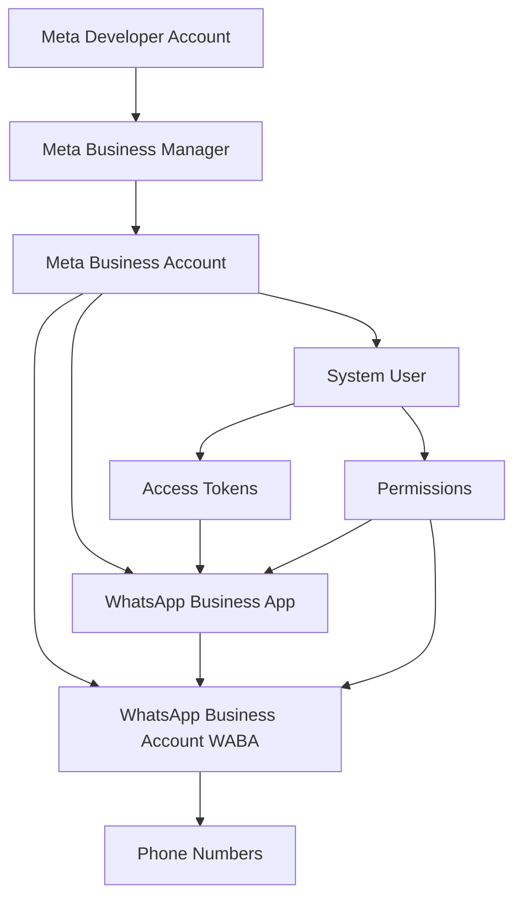

# WhatsApp Business API - Complete Setup Guide

**Meta WhatsApp Business Platform - Step-by-Step Setup**  
**Last Updated**: January 8, 2026

---

## Table of Contents

1. [Overview & Prerequisites](#overview--prerequisites)
2. [Understanding Meta Entities](#understanding-meta-entities)
3. [Complete Setup Flow](#complete-setup-flow)
4. [Step 1: Create Meta Developer Account](#step-1-create-meta-developer-account)
5. [Step 2: Create Meta Business Account](#step-2-create-meta-business-account)
6. [Step 3: Complete Business Verification](#step-3-complete-business-verification)
7. [Step 4: Create a WhatsApp Business App](#step-4-create-a-whatsapp-business-app)
8. [Step 5: Create WhatsApp Business Account (WABA)](#step-5-create-whatsapp-business-account-waba)
9. [Step 6: Add and Verify Phone Number](#step-6-add-and-verify-phone-number)
10. [Step 7: Create System User](#step-7-create-system-user)
11. [Step 8: Generate Permanent Access Token](#step-8-generate-permanent-access-token)
12. [Step 9: Configure Webhooks](#step-9-configure-webhooks)
13. [Step 10: Create Message Templates](#step-10-create-message-templates)
14. [Testing Your Setup](#testing-your-setup)
15. [Troubleshooting](#troubleshooting)
16. [2026-Specific Considerations](#2026-specific-considerations)

---

## Overview & Prerequisites

### What You'll Need

**Before starting**, ensure you have:

- ✅ A valid business (registered company or sole proprietorship)
- ✅ Official business documents (license, certificate of incorporation, etc.)
- ✅ Business email address
- ✅ Business phone number (different from your WhatsApp number)
- ✅ **New, unused phone number** for WhatsApp Business API
- ✅ Website domain (recommended but not mandatory)
- ✅ Business address proof (utility bill, bank statement)

**CRITICAL**: The phone number you use for WhatsApp Business API **CANNOT** be:
- Already registered with personal WhatsApp
- Already registered with WhatsApp Business App
- Currently in use on any other WhatsApp platform

---

## Understanding Meta Entities

Before setup, understand how different Meta entities relate to each other:



### Key Entities Explained

| Entity | Purpose | Who Owns It |
|--------|---------|-------------|
| **Meta Developer Account** | Your personal login to developers.facebook.com | You (individual) |
| **Meta Business Manager** | Central dashboard for business assets | Your business |
| **Meta Business Account** | Verified business entity on Meta | Your business |
| **WhatsApp Business App** | Application container for WhatsApp features | Your business |
| **WABA (WhatsApp Business Account)** | Container for phone numbers and messaging | Your business |
| **System User** | Non-human user for API access | Your business |
| **Access Token** | Authentication credential for API calls | Generated for System User |
| **Phone Number** | Actual WhatsApp number for messaging | Assigned to WABA |

---

## Complete Setup Flow

Here's the high-level flow you'll follow:

**Phase 1: Account Creation**
1. Meta Developer Account
2. Meta Business Manager & Business Account

**Phase 2: Verification**
3. Business Verification (Required for full features)

**Phase 3: App & WABA Setup**
4. Create WhatsApp Business App
5. Create WABA (or use existing)
6. Add and verify phone number

**Phase 4: Authentication Setup**
7. Create System User
8. Assign permissions to System User
9. Generate permanent access token

**Phase 5: Integration**
10. Configure webhooks
11. Create message templates
12. Test setup

---

## Step 1: Create Meta Developer Account

### 1.1 Sign Up

1. Go to [https://developers.facebook.com](https://developers.facebook.com)
2. Click **"Get Started"** in the top right
3. Choose one of:
   - **Login with existing Facebook account** (recommended)
   - **Create new Facebook account**
4. Accept Meta Platform Terms & Policies

### 1.2 Verify Your Account

- If using existing Facebook:
  - Already verified ✅
- If new account:
  - Verify email address
  - Verify phone number (SMS code)

**Checkpoint**: You can now access [developers.facebook.com/apps](https://developers.facebook.com/apps)

---

## Step 2: Create Meta Business Account

### 2.1 Access Business Settings

1. Go to [https://business.facebook.com](https://business.facebook.com)
2. Click **"Create Account"**
3. OR use existing Business Manager if you have one

### 2.2 Set Up Business

1. **Business Name**: Enter your legal business name
2. **Your Name**: Your name (admin)
3. **Business Email**: Company email (not personal)
4. Click **"Next"**

5. **Add Business Details**:
   - Business address
   - Business phone number
   - Website (if available)
   - Business description

6. Click **"Submit"**

**Checkpoint**: You now have access to **Business Settings** at [business.facebook.com/settings](https://business.facebook.com/settings)

---

## Step 3: Complete Business Verification

**WHY**: Verified businesses get:
- Higher messaging limits
- Ability to add multiple phone numbers
- Official green checkmark
- Full API features

### 3.1 Start Verification

1. Go to **Business Settings** > **Security Center**
2. Click **"Start Verification"**

### 3.2 Provide Business Information

**Required Information**:
- Legal business name (must match documents)
- Business address
- Business phone number
- Website (if available)
- Business type (LLC, Corporation, Sole Proprietorship, etc.)

### 3.3 Upload Documents

**Accepted Documents** (choose ONE):
- Business license
- Certificate of incorporation
- Articles of association
- Tax registration document
- Business bank statement
- Utility bill with business address

**Requirements**:
- Document must show legal business name
- Document must be recent (within 6 months)
- Document must be in JPEG, PNG, or PDF format
- File size < 8 MB
- Clear and readable

### 3.4 Verification Method

Choose how to receive verification code:

**Option A: Email Verification**
- **Email domain** must match your business website
- Example: if website is `company.com`, use `email@company.com`

**Option B: Phone Verification**
- Receive code via SMS or call
- May need to upload document confirming business phone number

**Option C: Domain Verification**
- Add Meta verification code to your website's DNS or HTML
- Best for established businesses with website access

### 3.5 Wait for Approval

- **Timeline**: 1-5 business days
- **Check Status**: Business Settings > Security Center
- You'll receive email notification when verified

**Checkpoint**: Status changes to **"Verified"** with green checkmark

---

## Step 4: Create a WhatsApp Business App

### 4.1 Navigate to App Creation

1. Go to [https://developers.facebook.com/apps/creation](https://developers.facebook.com/apps/creation)
2. Click **"Create App"**

### 4.2 Choose App Type

1. **Select "Business"** as app type
2. Click **"Next"**

### 4.3 App Details

1. **App Name**: Give your app a name
   - Example: "My Company WhatsApp API"
   - This is internal, customers won't see it

2. **App Contact Email**: Enter business email

3. Click **"Next"**

### 4.4 Connect Business Account

1. **Select your Business Account** (created in Step 2)
2. If you don't see it, click **"Create a Business Account"**

3. Click **"Next"**

### 4.5 Add WhatsApp Product

1. In the app dashboard, scroll down to **"Add products to your app"**
2. Find **"WhatsApp"**
3. Click **"Set Up"**

### 4.6 Configure WhatsApp

1. Review WhatsApp Business API overview
2. Agree to terms and policies
3. Click **"Get Started"**

**Checkpoint**: WhatsApp product is now added to your app

**Note Your App ID**:
- Go to **Settings > Basic**
- Copy your **App ID** and **App Secret**
- Store these securely

---

## Step 5: Create WhatsApp Business Account (WABA)

### 5.1 Access WhatsApp Manager

1. In your App Dashboard, click **"WhatsApp" > "Getting Started"**
2. OR go to [https://business.facebook.com/wa/manage](https://business.facebook.com/wa/manage)

### 5.2 Create or Select WABA

**Option A: Create New WABA**
1. Click **"Create a WhatsApp Business Account"**
2. Enter WABA name (e.g., "Company Name WhatsApp")
3. Select your **Business Manager**
4. Select **currency** and **timezone**
   - **IMPORTANT (2026)**: Choose carefully! Currency cannot be changed later
   - For India: Select **INR** for local billing (available Jan 2026)
5. Click **"Create"**

**Option B: Use Existing WABA**
1. Select from dropdown
2. Click **"Continue"**

**Checkpoint**: You now have a WABA ID (format: `1234567890123456`)

---

## Step 6: Add and Verify Phone Number

### 6.1 Prepare Your Phone Number

**CRITICAL Requirements**:
- Must be able to receive SMS or voice calls
- Must include country code (e.g., `+91` for India)
- Must NOT be registered on:
  - Personal WhatsApp
  - WhatsApp Business App
  - Another WhatsApp Business API account
- Cannot be a short code
- Must be a mobile number (landlines not recommended)

**If number is currently in use**:
1. Delete it from personal WhatsApp or WhatsApp Business App
2. Wait 24 hours before proceeding

### 6.2 Add Phone Number

1. In WhatsApp Manager, go to **"Phone Numbers"**
2. Click **"Add Phone Number"**
3. Enter phone number with country code
   - Example: `+919876543210` for India
4. Click **"Next"**

### 6.3 Verify Phone Number

**Choose verification method**:

**Option 1: SMS (Recommended)**
1. Select **"Text message (SMS)"**
2. Click **"Next"**
3. Check your phone for 6-digit code
4. Enter code
5. Click **"Verify"**

**Option 2: Voice Call**
1. Select **"Phone call"**
2. Click **"Next"**
3. Answer incoming call
4. Listen for 6-digit code
5. Enter code
6. Click **"Verify"**

### 6.4 Set Up Two-Step Verification (2FA)

**REQUIRED for security**:

1. Create a 6-digit PIN
2. Confirm PIN
3. Provide email for PIN recovery
4. Click **"Save"**

**IMPORTANT**: Store this PIN securely! You'll need it to:
- Change the PIN
- Delete the phone number
- Transfer the number

**Checkpoint**: Phone number shows as **"Connected"** with green status

---

## Step 7: Create System User

**WHY**: System Users are for programmatic API access (your server calling WhatsApp API)

**Benefits**:
- Token doesn't expire when you change your Facebook password
- Not tied to any individual's Facebook account
- Best practice for production systems

### 7.1 Access System Users

1. Go to **Business Settings** ([business.facebook.com/settings](https://business.facebook.com/settings))
2. In sidebar, click **"Users" > "System Users"**

### 7.2 Create New System User

1. Click **"Add"** button
2. **System User Name**: Give it a descriptive name
   - Example: `whatsapp-api-production`
3. **System User Role**: Select **"Admin"**
   - Needed for full WhatsApp API access
4. Click **"Create System User"**

**Checkpoint**: System User appears in the list

---

## Step 8: Generate Permanent Access Token

### 8.1 Assign Assets to System User

**Assign WhatsApp App**:
1. Click on your System User name
2. Click **"Add Assets"**
3. Select **"Apps"** tab
4. Find your WhatsApp Business App
5. Toggle **"Full Control"** ON
6. Click **"Save Changes"**

**Assign WABA**:
1. Still in System User view
2. Click **"Add Assets"** again
3. Select **"WhatsApp Accounts"** tab
4. Find your WABA
5. Toggle **"Full Control"** ON
6. Click **"Save Changes"**

### 8.2 Generate Token

1. With System User selected, click **"Generate New Token"**
2. **Select App**: Choose your WhatsApp Business App
3. **Token Expiration**: Select **"Never"** (permanent token)
   - ⚠️ CRITICAL: Do NOT select 60 days or other temporary option
4. **Permissions**: Select ALL of the following:
   - `business_management`
   - `whatsapp_business_management`
   - `whatsapp_business_messaging`
5. Click **"Generate Token"**

### 8.3 Copy and Secure Token

**⚠️ CRITICAL**: The token is only shown ONCE!

1. Copy the entire token (very long string)
2. Store it in a secure location:
   - Password manager
   - Encrypted environment variables
   - Secure vault

**DO NOT**:
- Commit to Git
- Share in plain text
- Email to anyone
- Store in frontend code

**Example Token Format**:
```
EAAxxxxxxxxxxxxxxxxxxxxxxxxxxxxxxxxxxxxxxxxxxxxxxxxxxxxxxxxxxxxxxxxxxxxx
```

**Checkpoint**: You now have a permanent access token for API calls

---

## Step 9: Configure Webhooks

**WHY**: Webhooks receive real-time notifications about:
- Incoming messages from customers
- Message delivery status
- Read receipts
- Customer profile updates

### 9.1 Set Up Webhook Endpoint

**Your Server Requirements**:
- Publicly accessible HTTPS endpoint
- Valid SSL certificate (free via Let's Encrypt)
- Can handle POST requests
- Can respond to GET requests for verification

**Example Endpoint**: `https://your-server.com/webhooks/whatsapp`

### 9.2 Implement Webhook Verification

**Meta will make a GET request** to verify your endpoint:

```javascript
// Node.js example
app.get('/webhooks/whatsapp', (req, res) => {
  const VERIFY_TOKEN = 'your-secret-verify-token';
  
  const mode = req.query['hub.mode'];
  const token = req.query['hub.verify_token'];
  const challenge = req.query['hub.challenge'];
  
  if (mode === 'subscribe' && token === VERIFY_TOKEN) {
    console.log('Webhook verified');
    res.status(200).send(challenge);
  } else {
    res.sendStatus(403);
  }
});
```

### 9.3 Configure in Meta

1. In App Dashboard, go to **WhatsApp > Configuration**
2. Find **Webhooks** section
3. Click **"Configure Webhooks"** or **"Edit"**

4. **Callback URL**: Enter your webhook endpoint
   - Example: `https://your-server.com/webhooks/whatsapp`

5. **Verify Token**: Enter a secret string
   - Example: `my-super-secret-token-12345`
   - Must match what your server expects

6. Click **"Verify and Save"**

**Meta will call your endpoint** to verify. If successful, you'll see:
✅ **"Webhook verified successfully"**

### 9.4 Subscribe to Webhook Fields

1. In same Webhooks section, find **"Webhook Fields"**
2. Subscribe to events you need:
   - ✅ `messages` (incoming messages)
   - ✅ `message_status` (delivery, read receipts)
   - ✅ `messaging_account_settings_updates` (account changes)
3. Click **"Save"**

### 9.5 Implement Webhook Handler

```javascript
// Node.js example
app.post('/webhooks/whatsapp', (req, res) => {
  const body = req.body;
  
  // Return 200 OK immediately
  res.sendStatus(200);
  
  // Process webhook async
  if (body.object === 'whatsapp_business_account') {
    body.entry.forEach(entry => {
      const changes = entry.changes;
      changes.forEach(change => {
        if (change.field === 'messages') {
          const value = change.value;
          
          if (value.messages) {
            value.messages.forEach(message => {
              console.log('New message:', message);
              // Process message
            });
          }
        }
      });
    });
  }
});
```

**Checkpoint**: Webhooks configured and receiving test events

---

## Step 10: Create Message Templates

**WHY**: You can ONLY send template messages to customers who haven't messaged you first.

### 10.1 Access Templates

1. Go to [https://business.facebook.com/wa/manage/message-templates](https://business.facebook.com/wa/manage/message-templates)
2. OR in WhatsApp Manager > **Message Templates**

### 10.2 Create Template

1. Click **"Create Template"**

2. **Template Name**:
   - Use lowercase and underscores only
   - Example: `welcome_message` or `order_confirmation`

3. **Category**: Choose ONE:
   - **Marketing**: Promotions, offers, announcements
   - **Utility**: Order updates, appointment reminders, alerts
   - **Authentication**: OTPs, login codes

4. **Language**: Select language(s)

### 10.3 Template Structure

**Header** (Optional):
- **Text**: Short heading
- **Media**: Image, video, or document
- **Variables**: Use `{{1}}` for dynamic content

**Body** (Required):
- Message text (up to 1024 characters)
- **Variables**: `{{1}}`, `{{2}}`, `{{3}}`, etc.
- Be specific and clear
- Include unsubscribe info for marketing

**Footer** (Optional):
- Small text at bottom
- No variables allowed
- Example: "Company Name - Support: +91-XXXXXXXXXX"

**Buttons** (Optional):
- **Quick Reply**: Up to 3 buttons
- **Call to Action**: Phone number or website URL
- **Copy Code**: For OTP/promo codes

### 10.4 Submit for Approval

1. Review template
2. Click **"Submit"**

**Approval Time**:
- **Utility/Authentication**: Few hours to 1 day
- **Marketing**: 1-2 days

**Status**:
- ⏳ **Pending**: Under review
- ✅ **Approved**: Ready to use
- ❌ **Rejected**: Check rejection reason, edit and resubmit

### 10.5 Example Templates

**Utility - Order Confirmation**:
```
Name: order_confirmation
Category: Utility

Header: Text - "Order Confirmed"
Body: 
Hi {{1}},
Your order #{{2}} has been confirmed!
Amount: ₹{{3}}
Estimated delivery: {{4}}

You'll receive updates as your order moves.

Footer: ABC Company - Track: abc.com/track
```

**Marketing - Promotion**:
```
Name: sale_announcement
Category: Marketing

Header: Image - sale_banner.jpg
Body:
Hi {{1}}!
🎉 MEGA SALE is live! 
Get up to 50% OFF on {{2}}
Use code: {{3}}
Valid till: {{4}}

Shop now: {{5}}
Reply STOP to unsubscribe

Footer: Happy Shopping! - BrandName
Buttons: [Visit Website - https://example.com/sale]
```

**Checkpoint**: At least one template approved and ready to use

---

## Testing Your Setup

### Test 1: Send Test Message

Using your access token and approved template:

```bash
curl -X POST \
  'https://graph.facebook.com/v18.0/YOUR_PHONE_NUMBER_ID/messages' \
  -H 'Authorization: Bearer YOUR_ACCESS_TOKEN' \
  -H 'Content-Type: application/json' \
  -d '{
    "messaging_product": "whatsapp",
    "to": "RECIPIENT_PHONE_NUMBER",
    "type": "template",
    "template": {
      "name": "hello_world",
      "language": {
        "code": "en_US"
      }
    }
  }'
```

**Get Your Phone Number ID**:
1. Go to WhatsApp Manager > Phone Numbers
2. Click on your phone number
3. Copy the **Phone Number ID** (different from phone number itself)

### Test 2: Receive Message

1. Send a WhatsApp message TO your business number from your personal phone
2. Check your webhook endpoint logs
3. You should receive a JSON payload with the message

### Test 3: Reply to Message

Within 24 hours of receiving a customer message, you can send free-form replies:

```bash
curl -X POST \
  'https://graph.facebook.com/v18.0/YOUR_PHONE_NUMBER_ID/messages' \
  -H 'Authorization: Bearer YOUR_ACCESS_TOKEN' \
  -H 'Content-Type: application/json' \
  -d '{
    "messaging_product": "whatsapp",
    "to": "RECIPIENT_PHONE_NUMBER",
    "type": "text",
    "text": {
      "body": "Thank you for your message! How can I help you?"
    }
  }'
```

---

## Troubleshooting

### Issue: "Phone number already registered"

**Solution**:
1. Delete number from personal WhatsApp or Business App
2. Wait 24 hours
3. Try again

### Issue: "Business verification pending"

**Solution**:
- Check Business Settings > Security Center for status
- May take up to 5 business days
- Can still test with limited features while pending

### Issue: "Template rejected"

**Common Reasons**:
- Contains prohibited content (crypto, adult, etc.)
- Missing required disclaimers for marketing
- Variables not properly formatted
- Too promotional

**Solution**:
- Read rejection reason carefully
- Edit template
- Resubmit

### Issue: "Webhook verification failed"

**Solution**:
- Ensure endpoint is HTTPS with valid SSL
- Check verify token matches exactly
- Make sure GET endpoint returns challenge
- Check firewall/security settings

### Issue: "API calls return 401 Unauthorized"

**Solution**:
- Verify access token is correct
- Ensure token has required permissions
- Check token hasn't expired (if not permanent)
- Regenerate token if needed

### Issue: "Message sending fails with error 131047"

**Reason**: Recipient hasn't opted in

**Solution**:
- Can only send templates to users who haven't messaged you
- Or wait for customer to message you first
- Ensure opt-in process is in place

---

## 2026-Specific Considerations

### New Currency Options

**Starting January 2026**, Meta allows local currency billing:

**India**: Available from January 1, 2026
- Select **INR** when creating WABA
- Billed through Meta India entity
- Lower exchange rate risk

**Brazil**: Available later in 2026
- Select **BRL** when creating WABA

⚠️ **CRITICAL**: Currency cannot be changed after WABA creation. Choose wisely!

### Pricing Updates

Meta will update pricing **up to 4 times per year**:
- January 1
- April 1
- July 1
- October 1

**Action**: Budget for potential quarterly rate changes

### Per-Message Billing

Effective January 1, 2026, pricing is **per-message** for templates (not per-conversation):

| Type | India Cost |
|------|------------|
| Marketing | ₹1.09/msg |
| Utility | ₹0.145/msg |
| Authentication | ₹0.145/msg |
| Service (24hr window) | FREE |

---

## Summary Checklist

Before going live, ensure you have:

- [ ] Meta Developer Account created
- [ ] Meta Business Account created and verified
- [ ] WhatsApp Business App created
- [ ] WABA created with correct currency
- [ ] Phone number added and verified
- [ ] Two-step verification (2FA) set up
- [ ] System User created
- [ ] Permanent access token generated and secured
- [ ] Webhooks configured and tested
- [ ] At least 2-3 message templates approved
- [ ] Test messages sent successfully
- [ ] Webhook receiving messages successfully
- [ ] Documented all credentials securely

---

## Important Security Notes

**Protect Your Credentials**:
- ✅ Store access tokens in environment variables
- ✅ Use HTTPS for all webhook endpoints
- ✅ Validate webhook signatures
- ✅ Rotate tokens periodically
- ✅ Use system users instead of personal accounts
- ❌ Never commit tokens to Git
- ❌ Never share tokens in plain text
- ❌ Never use temporary tokens in production

---

## Next Steps

After setup, you can:
1. **Integrate with your application** using the access token
2. **Build conversation flows** in your code
3. **Monitor usage** in WhatsApp Manager > Analytics
4. **Scale messaging limits** by demonstrating quality messaging
5. **Add multiple phone numbers** (after verification)
6. **Implement advanced features** like interactive messages

---

## Useful Resources

- [Meta WhatsApp Documentation](https://developers.facebook.com/docs/whatsapp)
- [WhatsApp Business API Reference](https://developers.facebook.com/docs/whatsapp/api/messages)
- [Business Verification Guide](https://www.facebook.com/business/help/159334372093366)
- [Webhook Reference](https://developers.facebook.com/docs/whatsapp/webhooks)
- [Template Guidelines](https://developers.facebook.com/docs/whatsapp/message-templates/guidelines)
- [System Users Guide](https://www.facebook.com/business/help/503306463479099)

---

## Support

**Meta Support**:
- WhatsApp Manager: [business.facebook.com/wa/manage](https://business.facebook.com/wa/manage)
- Business Help Center: [facebook.com/business/help](https://facebook.com/business/help)
- Developer Community: [developers.facebook.com/community](https://developers.facebook.com/community)

---

**Document Version**: 1.0  
**Last Updated**: January 8, 2026  
**Covers**: Meta WhatsApp Business Platform v18.0+
