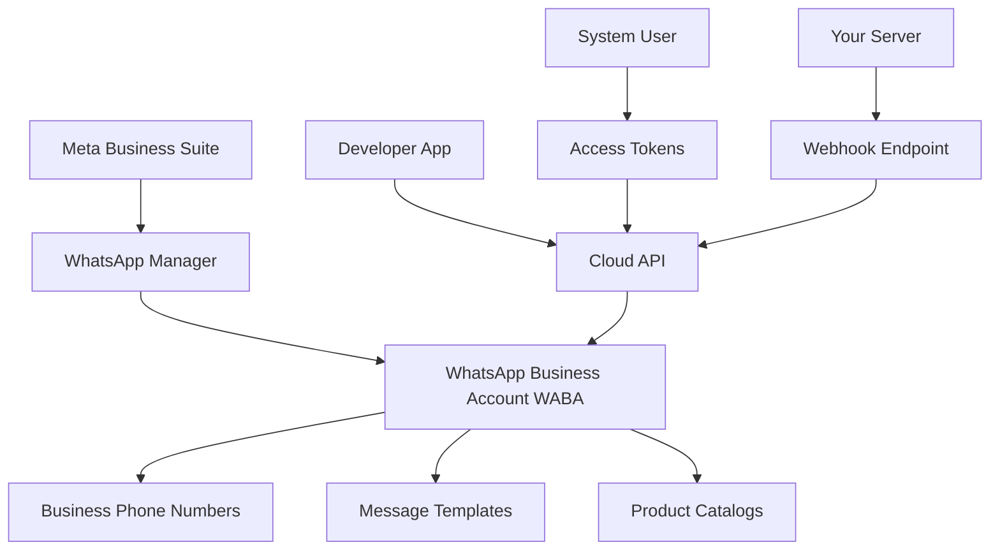
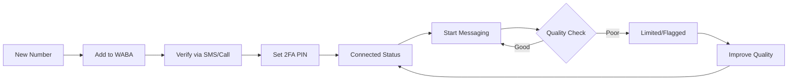
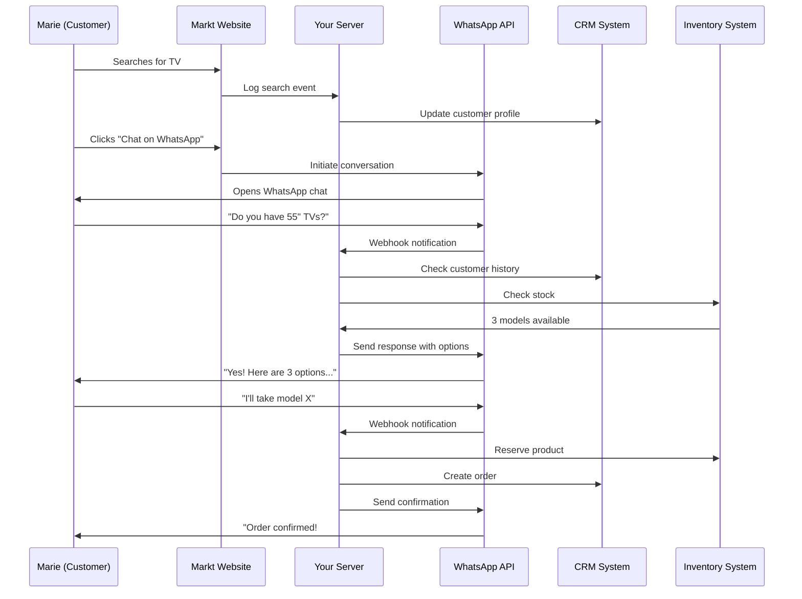

# WhatsApp Business Platform - Complete Technical Guide

**Comprehensive Tutorial on Technical Components, Capabilities, and Implementation**

**Last Updated**: January 8, 2026  
**Source**: Meta WhatsApp Business Platform Official Training

---

## Table of Contents

1. [Introduction to WhatsApp Business Platform](#introduction)
2. [Core Components & Terminology](#core-components)
3. [UI and Account Management](#ui-and-accounts)
4. [APIs and Technical Infrastructure](#apis-and-infrastructure)
5. [Business Assets](#business-assets)
6. [Developer Requirements](#developer-requirements)
7. [Platform Capabilities](#platform-capabilities)
8. [Integration Architecture](#integration-architecture)
9. [Use Cases and Applications](#use-cases)
10. [Ads That Click to WhatsApp](#ads-integration)
11. [Conversions API](#conversions-api)
12. [Provider Ecosystem](#provider-ecosystem)
13. [Best Practices](#best-practices)

---

## Introduction to WhatsApp Business Platform {#introduction}

### What is WhatsApp Business Platform?

Unlike **WhatsApp** (consumer app) and **WhatsApp Business app** (SMB app), the **WhatsApp Business Platform** is an **API-based solution** designed for medium to large businesses.

**Key Difference**:
- ❌ **NOT** a standalone app you download
- ✅ **IS** an API that integrates with your business systems

### Purpose

The WhatsApp Business Platform enables businesses to:
- 📱 Engage with customers at scale
- 🤝 Build meaningful, relationship-focused conversations
- 💬 Deliver personal experiences to millions of customers
- 🔗 Integrate messaging into existing business workflows

### Target Audience

**Best For**:
- Medium to large enterprises
- E-commerce platforms
- Service providers (airlines, banks, healthcare)
- Businesses with customer support teams
- Companies with CRM systems
- Brands running marketing campaigns

**Not Ideal For**:
- Very small businesses (< 10 messages/day) → Use WhatsApp Business App
- Personal use → Use regular WhatsApp

---

## Core Components & Terminology {#core-components}

Understanding the key components is crucial for successful implementation.

### Component Hierarchy



### Essential Terminology

| Term | Definition | Example |
|------|------------|---------|
| **WABA** | WhatsApp Business Account - Container for all business messaging assets | "ABC Corp WhatsApp" |
| **Cloud API** | Meta-hosted API for sending/receiving messages | `graph.facebook.com/v18.0/` |
| **Business Phone Number** | Dedicated number for WhatsApp messaging | `+919876543210` |
| **Message Template** | Pre-approved message format for business-initiated conversations | "Your order #{{1}} is ready" |
| **Webhook** | Your server endpoint that receives real-time notifications | `https://yourserver.com/webhooks` |
| **Access Token** | Authentication credential for API calls | `EAAxxxx...` |
| **System User** | Non-human account for API access | `whatsapp-api-prod` |

---

## UI and Account Management {#ui-and-accounts}

### Meta Business Suite

**What It Is**:
- Central dashboard for managing all Meta business activities
- Access point for WhatsApp Manager, Ads Manager, and other tools
- Unified view of business performance across Meta platforms

**URL**: [https://business.facebook.com](https://business.facebook.com)

**Key Features**:
- 📊 Cross-platform analytics
- 💼 Asset management (Pages, Apps, WABAs)
- 👥 Team member permissions
- 🔐 Security settings

### WhatsApp Manager

**What It Is**:
- Specialized tool for managing WhatsApp Business accounts
- Accessed through Meta Business Suite
- Primary interface for non-technical WhatsApp management

**URL**: [https://business.facebook.com/wa/manage](https://business.facebook.com/wa/manage)


**Key Sections**:
1. **Overview Dashboard**
   - Total conversations
   - Free-tier conversation usage
   - Approximate charges
   - Phone number performance

2. **Account Tools**
   - **Message Templates**: Create and manage templates
   - **Phone Numbers**: Add, verify, and manage numbers
   - **Catalog**: Product catalog management
   - **Insights**: Analytics and reporting

3. **Phone Number Metrics**
   - Business-initiated conversations (last 24 hours)
   - Quality rating
   - Messaging limits

### WhatsApp Business Account (WABA)

**Two Types**:

**1. Default Business Account**
- Standard account for any verified business
- No verification badge
- Still has full API access

**2. Official Business Account**
- ✅ Green verification badge next to business name
- Indicates Meta has verified the business
- Builds customer trust
- Requires business verification process

**Benefits of Official Account**:
- Higher credibility with customers
- Better deliverability
- Access to advanced features first
- Enhanced brand protection

**Documentation**: [Official Business Account Guide](https://www.facebook.com/business/help/3273529806299830)

---

## APIs and Technical Infrastructure {#apis-and-infrastructure}

### 1. Cloud API (Hosted by Meta)

**What It Is**:
The Cloud API is Meta's managed infrastructure for WhatsApp Business messaging.

**Key Benefits**:
- ✅ **Scalable**: Handles millions of messages
- ✅ **Reliable**: 99.9% uptime SLA
- ✅ **Secure**: End-to-end encryption maintained
- ✅ **Managed**: No infrastructure to maintain
- ✅ **Fast**: Low latency globally

**Core Capabilities**:
- Send messages (text, media, interactive, templates)
- Receive messages via webhooks
- Manage phone numbers programmatically
- Upload media
- Mark messages as read
- Get phone number insights

**Local Storage Feature**:
For businesses in regulated industries (finance, healthcare, government):
- Control where message data is stored at rest
- Comply with data residency requirements
- Choose specific regions for data storage

**Example**: A German bank can ensure all message data stays in EU servers.

**Documentation**: 
- [Cloud API Overview](https://developers.facebook.com/docs/whatsapp/cloud-api)
- [Local Storage](https://developers.facebook.com/docs/whatsapp/cloud-api/overview/local-storage/)

### 2. WhatsApp Business Management API

**What It Is**:
Separate API for managing WhatsApp business assets (not for sending messages).

**Use Cases**:
- Create and manage WABAs
- Add/remove phone numbers
- Get quality status updates
- Manage message templates
- Configure account settings
- Assign permissions

**Common Operations**:
```bash
# Get WABA details
GET /v18.0/{waba-id}

# Get template list
GET /v18.0/{waba-id}/message_templates

# Get phone number quality
GET /v18.0/{phone-number-id}
```

**Documentation**: [Business Management API](https://developers.facebook.com/docs/whatsapp/business-management-api)

### 3. Graph API (Foundation)

**What It Is**:
The underlying API that both Cloud API and Business Management API are built on.

**Purpose**:
- HTTP-based API for Meta technologies
- Primary way to get data in/out of Meta platforms
- Unified structure across all Meta APIs

**Core Concepts**:
- **Nodes**: Individual objects (WABA, Phone Number, Template)
- **Edges**: Connections between nodes (WABA → Phone Numbers)
- **Fields**: Properties of nodes (name, status, quality_rating)

**Example Request**:
```bash
curl -X GET \
  'https://graph.facebook.com/v18.0/me/accounts' \
  -H 'Authorization: Bearer ACCESS_TOKEN'
```

**Error Handling**:
Graph API returns structured error responses:
```json
{
  "error": {
    "message": "Error description",
    "type": "OAuthException",
    "code": 190,
    "fbtrace_id": "unique-trace-id"
  }
}
```

**Documentation**:
- [Graph API Overview](https://developers.facebook.com/docs/graph-api/)
- [Error Handling](https://developers.facebook.com/docs/graph-api/guides/error-handling)

---

## Business Assets {#business-assets}

### What Are Business Assets?

Business assets are any resources owned by a business on the WhatsApp Business Platform.

**Types of Assets**:
1. WhatsApp Business Accounts (WABAs)
2. Business phone numbers
3. Message templates
4. Product catalogs
5. Media files
6. Webhooks

### Business Phone Numbers

**Requirements**:

✅ **Must Have**:
- Owned by you or your client
- Country code and area code
- Ability to receive voice calls OR SMS
- Mobile number (landlines not recommended)

❌ **Cannot Be**:
- Short codes
- Currently registered on personal WhatsApp
- Currently on WhatsApp Business App
- Shared across multiple WABAs simultaneously
- Toll-free numbers (in most countries)

**Phone Number Lifecycle**:



**Best Practices**:
- Use a new, dedicated number
- Choose a memorable, local number
- Set up 2FA immediately
- Monitor quality ratings
- Have backup numbers ready

---

## Developer Requirements {#developer-requirements}

### 1. Developer Apps

**What They Are**:
Applications registered with Meta for Developers to obtain credentials and access APIs.

**Creating an App Gives You**:
- **App ID**: Unique identifier for your application
- **App Secret**: Secret key for authentication (keep secure!)
- **Access to APIs**: Graph API, Cloud API, Management API
- **Webhooks**: Ability to receive real-time notifications

**Registration Process**:
1. Go to [developers.facebook.com/apps](https://developers.facebook.com/apps)
2. Click "Create App"
3. Select "Business" type
4. Choose "WhatsApp" use case
5. Provide app details
6. Link to Business Account

### 2. Business Verification

**Why Required**:
Business verification unlocks full platform capabilities.

**Benefits After Verification**:
- ✅ Higher messaging limits (1000+ conversations/day)
- ✅ Add multiple phone numbers (up to 20+)
- ✅ Request Official Business Account badge
- ✅ Access to advanced features
- ✅ Better deliverability

**When to Initiate**:
- Before scaling marketing campaigns
- When adding phone numbers beyond the first 2
- When requesting verification badge
- When hitting messaging limits

**Verification Process**:
1. Provide legal business documentation
2. Verify business address
3. Confirm business phone/email
4. Wait 1-5 business days for review

### 3. Message Templates

**What They Are**:
Pre-approved message formats that businesses can use to initiate conversations with customers.

**Why Needed**:
WhatsApp's policy requires template approval to prevent spam.

**Template Structure**:

```
┌────────────────────────────┐
│  HEADER (Optional)         │
│  Text, Image, Video, Doc   │
├────────────────────────────┤
│  BODY (Required)           │
│  Main message text         │
│  Can include variables     │
├────────────────────────────┤
│  FOOTER (Optional)         │
│  Small text, no variables  │
├────────────────────────────┤
│  BUTTONS (Optional)        │
│  Quick Reply, CTA, etc.    │
└────────────────────────────┘
```

**Categories**:
- **Marketing**: Promotions, offers, announcements (₹1.09/msg in India)
- **Utility**: Order updates, reminders, alerts (₹0.145/msg)
- **Authentication**: OTPs, login codes (₹0.145/msg)

**Variables**:
Use `{{1}}`, `{{2}}`, `{{3}}` for dynamic content:
```
Hi {{1}}, your order #{{2}} totaling {{3}} is confirmed!
```

Becomes:
```
Hi Rahul, your order #12345 totaling ₹999 is confirmed!
```

### 4. Access Tokens

**What They Are**:
Authentication credentials that allow your app to call the Graph API.

**Two Types**:

**User Access Tokens**:
- Tied to a Facebook user account
- Expire when password changes
- Short-lived (hours) or long-lived (60 days)
- ❌ NOT recommended for production

**System User Access Tokens**:
- Tied to a system user (not a person)
- Can be permanent (never expire)
- Independent of user accounts
- ✅ RECOMMENDED for production

**Token Permissions**:
WhatsApp requires these scopes:
- `business_management`
- `whatsapp_business_management`
- `whatsapp_business_messaging`

**Security**:
```bash
# ❌ NEVER do this
const TOKEN = "EAAxxxx..."; // Hardcoded

# ✅ DO this
const TOKEN = process.env.WHATSAPP_ACCESS_TOKEN;
```

**Documentation**: [Access Tokens Guide](https://developers.facebook.com/docs/facebook-login/access-tokens)

### 5. Webhook Endpoints

**What They Are**:
HTTPS endpoints on YOUR server that Meta calls to send you notifications.

**Webhook Events**:
- 📨 **messages**: Customer sent you a message
- ✅ **message_status**: Message delivered/read/failed
- 👤 **account_updates**: Customer profile changes
- 📞 **phone_number_updates**: Phone number status changes
- 📝 **template_updates**: Template approval status

**Implementation Example**:

```javascript
// Webhook Verification (GET request)
app.get('/webhooks/whatsapp', (req, res) => {
  const VERIFY_TOKEN = process.env.WEBHOOK_VERIFY_TOKEN;
  
  const mode = req.query['hub.mode'];
  const token = req.query['hub.verify_token'];
  const challenge = req.query['hub.challenge'];
  
  if (mode === 'subscribe' && token === VERIFY_TOKEN) {
    console.log('✅ Webhook verified');
    res.status(200).send(challenge);
  } else {
    console.log('❌ Verification failed');
    res.sendStatus(403);
  }
});

// Webhook Notifications (POST request)
app.post('/webhooks/whatsapp', (req, res) => {
  // Respond immediately
  res.sendStatus(200);
  
  // Process asynchronously
  const body = req.body;
  
  if (body.object === 'whatsapp_business_account') {
    body.entry.forEach(entry => {
      entry.changes.forEach(change => {
        if (change.field === 'messages') {
          const value = change.value;
          
          if (value.messages) {
            value.messages.forEach(message => {
              console.log('New message from:', message.from);
              console.log('Text:', message.text.body);
              
              // Process message
              handleIncomingMessage(message);
            });
          }
        }
      });
    });
  }
});
```

**Requirements**:
- ✅ HTTPS with valid SSL certificate
- ✅ Publicly accessible URL
- ✅ Responds to GET for verification
- ✅ Responds with 200 to POST within 20 seconds
- ✅ Handles duplicate notifications (use message IDs)

---

## Platform Capabilities {#platform-capabilities}

### Comprehensive Capability Matrix

| Capability | Description | Available? | Notes |
|------------|-------------|------------|-------|
| **Environment** | | | |
| Cloud API | Meta-hosted API | ✅ Yes | Recommended |
| Local Storage | Control data residency | ✅ Yes | For regulated industries |
| **Integration** | | | |
| Chatbot Integration | Connect AI/bot platforms | ✅ Yes | Dialogflow, Rasa, custom |
| CRM Integration | Sync with CRM systems | ✅ Yes | Salesforce, HubSpot, Zoho |
| Website Integration | Click-to-chat on website | ✅ Yes | Via wa.me links or API |
| Agent Chat Interface | Human agent dashboard | ✅ Yes | Build custom or use partners |
| Reservations System | Booking/appointment systems | ✅ Yes | Via API integration |
| Inventory Management | Stock/product systems | ✅ Yes | Via API integration |
| **Usage Rules** | | | |
| Messaging Limits | Daily conversation caps | ✅ Yes | Tier 1: 1k, Tier 2: 10k, Tier 3: 100k, Unlimited |
| Quality Ratings | Phone number quality score | ✅ Yes | Green, Yellow, Red status |
| Policy Enforcement | Spam/scam detection | ✅ Yes | Automatic enforcement |
| **Verification** | | | |
| Official Business Account | Green badge verification | ✅ Yes | After business verification |
| Display Name Review | Business name approval | ✅ Yes | Reviewed by Meta |
| **Payments** | | | |
| In-Chat Payments | Native payment flow | ⚠️ Limited | India, Brazil, Singapore (selected countries) |
| Payment Gateway Integration | External payment links | ✅ Yes | Razorpay, Stripe, etc. |
| **Commerce** | | | |
| Product Catalogs | Showcase products | ✅ Yes | Up to 1000 items |
| Shopping Cart | Add-to-cart buttons | ✅ Yes | Via interactive messages |
| Order Management | Track orders in chat | ✅ Yes | Via utility templates |
| **Automation** | | | |
| Auto Responses | Automated away messages | ✅ Yes | Within 24-hour window |
| Quick Replies | Predefined response buttons | ✅ Yes | Up to 3 buttons |
| Interactive Messages | List messages, buttons | ✅ Yes | Rich interactions |
| **Migration** | | | |
| Phone Number Migration | Move number between WABAs | ✅ Yes | Via embedded signup or API |
| Template Migration | Copy templates to new account | ⚠️ Manual | Must recreate and re-approve |
| **Localization** | | | |
| Multi-Language Templates | Templates in multiple languages | ✅ Yes | 60+ languages supported |
| RTL Language Support | Right-to-left languages | ✅ Yes | Arabic, Hebrew, etc. |
| **Advanced Features** | | | |
| WhatsApp Flows | In-chat forms and interactions | ✅ Yes | Build custom experiences |
| Interactivity Options | Buttons, lists, coupons | ✅ Yes | Enhanced engagement |
| Media Sharing | Images, videos, documents, audio | ✅ Yes | Up to 100MB per file |
| Location Sharing | Send/receive location | ✅ Yes | Lat/long coordinates |
| Contact Sharing | vCard format | ✅ Yes | Share contact info |
| Stickers | Send stickers | ✅ Yes | Static and animated |

### WhatsApp Flows - Deep Dive

**What They Are**:
Interactive forms and experiences that live entirely within WhatsApp - no need to open external websites.

**Common Use Cases**:
- 📝 **Registration forms**: Collect user information
- 📅 **Appointment booking**: Schedule meetings/appointments
- 🛒 **Order placement**: Complete purchases in chat
- 📊 **Surveys**: Gather feedback
- 🎫 **Event registration**: Sign up for events

**Benefits**:
- Lower drop-off rates (no leaving WhatsApp)
- Faster completion times
- Better mobile experience
- Higher conversion rates

**Example Flow - Appointment Booking**:
```json
{
  "type": "flow",
  "screens": [
    {
      "id": "SELECT_SERVICE",
      "title": "Choose Service",
      "data": {
        "services": ["Haircut", "Color", "Styling"]
      }
    },
    {
      "id": "SELECT_DATE",
      "title": "Select Date",
      "data": {
        "available_dates": ["2026-01-10", "2026-01-11"]
      }
    },
    {
      "id": "CONFIRMATION",
      "title": "Confirm Booking",
      "data": {
        "summary": "{{service}} on {{date}} at {{time}}"
      }
    }
  ]
}
```

**Documentation**: [WhatsApp Flows Guide](https://developers.facebook.com/docs/whatsapp/flows/)

---

## Integration Architecture {#integration-architecture}

### System Integration Flow


### Back-End Systems Integration Example

**Scenario**: Customer shopping on e-commerce website

**Marie's Journey** (Fictitious example from Meta):



### Architecture Components

**1. Frontend Layer**:
- Website with "Chat on WhatsApp" button
- Mobile app with WhatsApp integration
- Social media ads that click to WhatsApp

**2. Application Layer**:
- Your business logic server
- Webhook handlers
- Message queue (for high volume)
- Caching layer (Redis/Memcached)

**3. Integration Layer**:
- WhatsApp Cloud API client
- CRM API integration
- Inventory system integration
- Payment gateway integration
- Analytics platform

**4. Data Layer**:
- Database (conversation history)
- File storage (media files)
- Session management
- User profiles

**Sample Technology Stack**:
```
Frontend: React website + WhatsApp Web Widget
Backend: Node.js (Express) + Bull (job queue)
Database: PostgreSQL (conversations) + Redis (sessions)
APIs: WhatsApp Cloud API, Salesforce CRM API
Hosting: AWS (EC2, RDS, S3)
```

---

## Use Cases and Applications {#use-cases}

### Use Case Categories


### 1. Marketing Use Cases

**Purpose**: Engage customers with promotional content they've opted into.

**Examples**:

**A. Seasonal Campaigns**
```
Template: seasonal_sale
Category: Marketing

Header: Image (summer_sale_banner.jpg)
Body: 
☀️ Summer Sale is LIVE!
Get up to 60% OFF on {{1}}
Use code: {{2}}
Valid until: {{3}}

Shop now and save big!
Reply STOP to unsubscribe

Footer: Happy Shopping! - FashionCo
Button: [Shop Now - https://fashionco.com/sale]
```

**B. Cart Abandonment**
```
Template: cart_reminder
Category: Marketing

Body:
Hi {{1}}! 👋
You left {{2}} items in your cart.

Complete your purchase now and get {{3}}% OFF
Use code: {{4}}

Your cart expires in 24 hours!

Footer: Need help? Reply to this message
Button: [Complete Purchase - https://store.com/cart/{{5}}]
```

**C. Product Recommendations**
```
Template: personalized_recommendations
Category: Marketing

Header: Text - "Picked Just For You"
Body:
Hi {{1}},
Based on your recent purchase of {{2}},
we think you'll love these:

📦 {{3}}
📦 {{4}}

Exclusive discount: {{5}}% OFF today only!

Footer: Reply STOP to unsubscribe
```

**Success Story**: 
[Telkomsel](https://business.whatsapp.com/resources/success-stories/telkomsel) re-engaged customers with marketing messages on WhatsApp, achieving:
- 70% open rates
- 25% click-through rates
- 3x higher engagement vs SMS

### 2. Utility Use Cases

**Purpose**: Send timely, relevant operational messages.

**Examples**:

**A. Order Confirmations**
```
Template: order_confirmation
Category: Utility

Header: Text - "Order Confirmed! 🎉"
Body:
Hi {{1}},
Your order #{{2}} is confirmed!

Items: {{3}}
Total: ₹{{4}}
Delivery: {{5}}

Track your order: {{6}}

Footer: ABC Store - Support available 24/7
```

**B. Appointment Reminders**
```
Template: appointment_reminder  
Category: Utility

Body:
Hi {{1}},
Reminder: You have an appointment tomorrow

📅 Date: {{2}}
⏰ Time: {{3}}
📍 Location: {{4}}
👨‍⚕️ With: Dr. {{5}}

Reply C to confirm or R to reschedule

Footer: HealthCare Clinic - +91-XXXXXXXXXX
Buttons: 
  [Confirm]
  [Reschedule]
```

**C. Booking Confirmations**
```
Template: flight_confirmation
Category: Utility

Header: Document (e-ticket.pdf)
Body:
✈️ Flight Booked!

Passenger: {{1}}
Flight: {{2}}
From: {{3}} → To: {{4}}
Date: {{5}}
Time: {{6}}
Seat: {{7}}
PNR: {{8}}

Check-in opens 24hrs before departure.

Footer: AirlineXYZ - Safe travels!
```

**Success Story**:
[Be@me](https://business.whatsapp.com/resources/success-stories/be-at-me) improved patient engagement with WhatsApp:
- 90% appointment confirmation rate
- 40% reduction in no-shows
- 24/7 availability for patient queries

### 3. Authentication Use Cases

**Purpose**: Secure account verification and login.

**Examples**:

**A. OTP Verification**
```
Template: otp_code
Category: Authentication

Body:
Your verification code is: {{1}}

This code expires in 10 minutes.
Do not share this code with anyone.

Footer: BankName Security Team
Button: [Copy Code]
```

**B. Login Alert**
```
Template: login_notification
Category: Authentication

Body:
New login detected:

Device: {{1}}
Location: {{2}}
Time: {{3}}
IP: {{4}}

If this wasn't you, secure your account immediately.
Code to verify: {{5}}

Footer: Security Team
Buttons:
  [This was me]
  [Secure Account]
```

### 4. Customer Support Use Cases

**Purpose**: Provide real-time assistance within 24-hour window (FREE).

**Features**:
- Live agent conversations
- Bot-first, human escalation
- Rich media support (images, videos)
- Quick reply buttons
- Location sharing

**Example Conversation Flow**:
```
Customer: "My order hasn't arrived"

Bot: "I'm sorry to hear that! Let me help. 
What's your order number?"

Customer: "12345"

Bot: "Thank you! I see order #12345 was 
shipped on Jan 5. Let me check the status..."

[Bot fetches from API]

Bot: "Your package is currently in transit.
Expected delivery: Tomorrow by 6 PM
📍 Track: [link]

Would you like to speak with an agent?"

Customer: [Clicks "Yes"]

[Escalated to human agent]

Agent: "Hi! I'm Sarah from customer support. 
I see your order is arriving tomorrow. 
Would you like me to expedite it?"
```

---

## Ads That Click to WhatsApp {#ads-integration}

### What Are Ads That Click to WhatsApp?

Meta ads (Facebook/Instagram) that send users directly into a WhatsApp conversation with your business when clicked.

### Requirements

**1. Onboarding and Access**

✅ **WhatsApp Business Platform**
- Must be onboarded to Cloud API
- Have approved message templates
- Active phone number

✅ **Meta Ads Manager**
- Access to create and manage ads
- Linked payment method
- Business verification (for larger budgets)

**2. Technical Setup**

✅ **Facebook Page Linked to WhatsApp**
- Your business Facebook Page
- Connected to your WhatsApp phone number

**Linking Methods**:

**Method 1: Manual (UI)**
1. Go to Facebook Page settings
2. Find "WhatsApp" section
3. Click "Connect"
4. Enter phone number and verify

**Method 2: Programmatic (API)**
```bash
curl -X POST \
  "https://graph.facebook.com/v18.0/{page-id}" \
  -H "Authorization: Bearer {access-token}" \
  -d "whatsapp_number={phone-number-id}"
```

**3. Assets Created**

Before running ads, create:
- ✅ Ad creative (images/videos)
- ✅ Ad copy
- ✅ WhatsApp message template (for auto-reply)
- ✅ Audience targeting parameters

### Best Practices

**1. Pre-filled Message**
Set a default message users see when clicking the ad:
```
"Hi! I'm interested in your summer sale."
```

**2. Instant Auto-Reply**
Send an immediate template response:
```
Template: ad_response_summer_sale

Body:
Thanks for your interest! 🎉
Our Summer Sale is live with up to 60% OFF!

Browse our collection: {{1}}
Use code: {{2}} for extra 10% OFF

How can I help you today?
```

**3. Bot-to-Human Handoff**
- Start with automated FAQ responses
- Escalate complex queries to agents
- Maintain 24-hour response window

**4. Track Performance**
Monitor these metrics in Ads Manager:
- **Link Clicks**: Users who clicked ad
- **Messaging Conversations Started**: Users who sent first message
- **Messaging Replies**: Businesses replies sent
- **Cost Per Messaging Conversation**: Ad cost ÷ conversations

---

## Conversions API {#conversions-api}

### What Is Conversions API?

The Conversions API enables businesses to send messaging events (like "message sent", "purchase completed") from their server to Meta to:
- Improve ad targeting
- Measure ad performance
- Optimize ad delivery

### Why It's Important

**Without Conversions API**:
- Meta doesn't know if ad clicks led to purchases
- Can't optimize ads for conversions
- Limited remarketing capabilities

**With Conversions API**:
- ✅ Track full customer journey
- ✅ Optimize ads for purchases, not just clicks
- ✅ Better audience targeting
- ✅ Accurate ROI measurement

### Implementation

**Step 1: Set Up**
1. Create Dataset in Meta Events Manager
2. Get Dataset ID and access token
3. Configure server-side events

**Step 2: Send Events**

**Example Events to Track**:
- `InitiateCheckout`: User adds item to cart
- `Purchase`: User completes purchase
- `Lead`: User requests quote
- `ViewContent`: User views product
- `AddToCart`: User adds to cart in WhatsApp chat
- `CompleteRegistration`: User signs up

**Sample Implementation**:
```javascript
const axios = require('axios');

async function sendConversionEvent(eventData) {
  const DATASET_ID = process.env.META_DATASET_ID;
  const ACCESS_TOKEN = process.env.META_ACCESS_TOKEN;
  
  const event = {
    data: [
      {
        event_name: 'Purchase',
        event_time: Math.floor(Date.now() / 1000),
        user_data: {
          ph: hashSHA256(eventData.phone), // Hash phone number
          fn: hashSHA256(eventData.firstName),
          ln: hashSHA256(eventData.lastName)
        },
        custom_data: {
          currency: 'INR',
          value: eventData.orderTotal,
          content_ids: [eventData.productId],
          content_type: 'product'
        },
        event_source_url: 'whatsapp://send',
        action_source: 'chat'
      }
    ]
  };
  
  await axios.post(
    `https://graph.facebook.com/v18.0/${DATASET_ID}/events`,
    event,
    {
      params: { access_token: ACCESS_TOKEN }
    }
  );
}
```

**Step 3: Verify**
- Use Meta Events Manager Test Events tool
- Check event quality score
- Monitor match rates

### Integration Methods

**1. Partner Integration**
- Use BSP partner's built-in Conversions API
- Easier setup, less coding
- Examples: Twilio, MessageBird, Wati

**2. Direct Integration**
- Build custom integration
- Full control and flexibility
- Requires development resources

---

## Provider Ecosystem {#provider-ecosystem}

### Types of Providers

**1. Solution Partners**
- Full-service WhatsApp providers
- Handle onboarding, hosting, support
- Best for non-technical businesses
- Examples: Interakt, AiSensy, WATI

**2. Tech Providers**
- Technology platforms with WhatsApp integration
- Focus on specific use cases (chatbots, CRM, etc.)
- Examples: Dialogflow, Freshchat, Zendesk

**3. Tech Partners**
- Infrastructure and API services
- For developers building custom solutions
- Examples: Twilio, MessageBird, Vonage

### Multi-Partner Solutions

Enables collaboration between different providers:

**Example Scenario**:
- **Tech Provider** (Chatbot platform) handles AI conversations
- **Solution Partner** (BSP) manages WhatsApp infrastructure
- **Business** gets best of both worlds

**How It Works**:
1. Business signs up with Solution Partner for WhatsApp
2. Solution Partner connects Tech Provider's platform
3. Tech Provider builds chatbot on their platform
4. Chatbot sends/receives via Solution Partner's WhatsApp connection

**Benefits**:
- Specialized solutions
- No need to switch providers
- Flexibility to mix and match

**Documentation**: [Multi-Partner Solutions](https://developers.facebook.com/docs/whatsapp/solution-providers/multi-partner-solutions)

---

## Best Practices {#best-practices}

### 1. Message Quality

**Do's**:
- ✅ Personalize messages with customer name
- ✅ Send only relevant, opted-in messages
- ✅ Respond quickly (< 1 hour ideal)
- ✅ Use rich media (images, videos) appropriately
- ✅ Provide clear call-to-action
- ✅ Honor opt-out requests immediately

**Don'ts**:
- ❌ Send spam or unsolicited messages
- ❌ Use misleading content
- ❌ Send messages to wrong category
- ❌ Ignore customer messages
- ❌ Send too many messages too quickly

### 2. Template Design

**Structure**:
```
✅ Good Template:
Header: "Order Update 📦"
Body: "Hi {{1}}, great news! Your order #{{2}} 
has shipped and will arrive on {{3}}. 
Track it here: {{4}}"
Footer: "ShopCo - Questions? Reply to chat"
Button: [Track Order]

❌ Poor Template:
Body: "Hello! Your stuff is coming. Check website."
```

**Tips**:
- Use emojis sparingly and contextually
- Keep body text under 3-4 lines
- Include clear next steps
- Add footer with brand name
- Test on mobile device

### 3. Conversation Management

**24-Hour Window Strategy**:
- Maximize free messaging within 24-hour window
- Send utility templates proactively when needed
- Use service conversations for support

**Response Times**:
- < 5 minutes: Excellent
- < 1 hour: Good
- < 24 hours: Acceptable
- > 24 hours: Requires template (charged)

### 4. Scaling Best Practices

**Start Small**:
- Begin with Tier 1 limit (1,000 conversations/day)
- Prove good quality rating
- Gradually increase volume

**Monitor Quality**:
- Check phone number quality rating daily
- Address customer blocks/reports immediately
- Maintain green status (> 4.5/5 rating)

**Infrastructure**:
- Use message queues for high volume
- Implement retry logic for failed messages
- Cache frequently used data
- Monitor API rate limits

**Example Queue Implementation**:
```javascript
// Using Bull queue
const Queue = require('bull');
const messageQueue = new Queue('whatsapp-messages', {
  redis: { host: 'localhost', port: 6379 }
});

// Add message to queue
messageQueue.add({
  to: '+919876543210',
  template: 'order_confirmation',
  parameters: ['Rahul', '12345', '₹999']
});

// Process queue
messageQueue.process(async (job) => {
  const { to, template, parameters } = job.data;
  await sendWhatsAppTemplate(to, template, parameters);
});
```

### 5. Security Best Practices

**Access Tokens**:
- Use system user tokens (not personal)
- Rotate tokens every 90 days
- Store in environment variables
- Never log tokens

**Webhook Security**:
- Validate webhook signature
- Use HTTPS only
- Implement rate limiting
- Log suspicious activity

**Data Privacy**:
- Don't store message content longer than needed
- Encrypt sensitive data
- Comply with GDPR/local privacy laws
- Provide data deletion on request

---

## Useful Resources

### Official Documentation
- [WhatsApp Business Platform](https://developers.facebook.com/products/whatsapp/)
- [Cloud API Docs](https://developers.facebook.com/docs/whatsapp/cloud-api)
- [Business Management API](https://developers.facebook.com/docs/whatsapp/business-management-api)
- [Graph API Reference](https://developers.facebook.com/docs/graph-api/)
- [WhatsApp Flows](https://developers.facebook.com/docs/whatsapp/flows/)

### Tools
- [Postman Collection](https://www.postman.com/case-studies/whatsapp/) - Pre-built API requests
- [Meta Events Manager](https://business.facebook.com/events_manager2) - Track conversions
- [WhatsApp API Webhook Tester](https://webhook.site/) - Test webhooks

### Learning Resources
- [WhatsApp Business Platform Training](https://www.facebookblueprint.com/student/collection/409587) - Official Meta courses
- [WhatsApp Developer YouTube](https://www.youtube.com/@WhatsAppBusiness) - Video tutorials
- [FAQ](https://faq.whatsapp.com/5773272372736965/) - Common questions

### Community
- [Developer Community Forum](https://developers.facebook.com/community/)
- [WhatsApp Business Blog](https://blog.whatsapp.com/business)
- [Success Stories](https://business.whatsapp.com/resources/success-stories)

---

**Document Version**: 2.0  
**Last Updated**: January 8, 2026  
**Based On**: Meta WhatsApp Business Platform Official Training Materials
